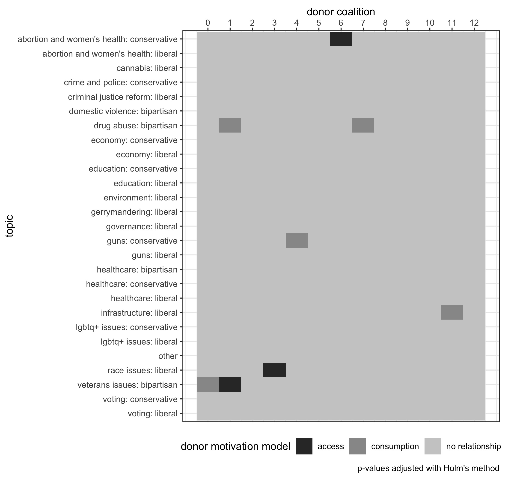

---
output:
  pdf_document:
    # citation_package: biblatex
    keep_tex: true
    fig_caption: true
    latex_engine: pdflatex
    template: ../svm-latex-ms.tex
title: "Political Donor Motivations and Public Support of Policies: A Time Series Analysis"
thanks: ""
author:
  - Ross Dahlke
affiliation: Stanford University
abstract: "The two predominant theories of political donor motivations are the access-oriented model and the consumption model. This paper combines political donation records and social media posts from politicians to test whether either behavior is observed. In the access-oriented model, individual political donors and political action committees (PACs) are assumed to contribute to campaigns in an effort to acquire access and influence politicians into supporting specific policy issues. In this study, the access-oriented model of donors predicts that donations from specific groups of donors will precede public support of certain policies. The consumption model of donors views political contributions as being an extension of voting along a participatory spectrum, and that donors support candidates who they already know support policy issues that the donors care about or are ideologically motivated. In this research, the consumption model predicts that donations from various groups of donors will lag in response to public support of certain policy issues. Historically, these two models have treated political donors as all having the same motivations. More recent studies in campaign finance have found that both motivational models can exist in different groups of donors. However, these studies categorize groups of donors in broad strokes, generally as either small-dollar donors and large-dollar donors as well as PACs. This paper statistically derives coalitions of similar donors and tests the competing models of political donor motivations on these more granular groups of donors who support similar candidates. "
keywords: ""
date: "`r format(Sys.time(), '%B %d, %Y')`"
geometry: margin=1in
fontfamily: mathpazo
fontsize: 12pt
spacing: double
bibliography: bibliography.bib
biblio-style: apsr
header-includes: \usepackage{graphicx}
---

```{r echo = F, message = F}
wordcountaddin:::text_stats()
```

\newpage

# Introduction

The amount of money raised and spent by political campaigns in the United States continues to rise with each election cycle [@goldmacher2020]. However, the explanations of the motivations of political donors, the psychological reasons why political donors decide to make a contribution, remain divided. The predominant theories of political donor motivation fall into two broad categories, the access-oriented model or the consumption model [@ansolabehere2003; @gordon2007; @welch1980]. In the access-oriented model, contributions are given in exchange for access and political favors that presumably materialize in altered government policy [@welch1980]. The consumption model of donations sees donors as participants in the political process who seek to alter election probabilities in a way that helps one's preferred campaign, similar to how voting seeks to help a campaign achieve election [@welch1980]. 

The prevalence of the two theories in political science literature changes throughout time. In the twentieth century, the bulk of academic inquiry into the motivations of political donors focused on the access-oriented model, particularly around Political Action Committees (PACs) and interest groups politics [e.g., @herndon1982; @langbein1986]. In the early- to mid-2000s, political scientists shifted their focus to and found evidence of the consumption model of donor motivations [e.g., @ansolabehere2003]. In response to the _Citizens United_ U.S. Supreme Court case in 2010, research focus again shifted back to the effects of the increased amount of money being donated to political campaigns and causes [e.g., @fouirnaies2018; @kalla2016; @mckay2018]. While much of the research history of political donor motivations has either pitted the two models of motivation against one another [@ansolabehere2003; @gordon2007; @welch1980], or operated exclusively in the domain of one and not the other [@fellowes2004; @gordon2001; @wright1985], recent scholarship has developed a more nuanced view of the motivations of political donors in that they are not a monolith and different donors can have different motivations.

One emerging view on the motivations of political donors is that donors are unique actors. Different donors may have different motivations, intents, and goals in making a political contribution. This recent scholarship has divided political donors into different groups and studied the two models, access-oriented and consumption, within these different groups. One one end of the granularity spectrum, the entirety of political donors can be divided into PACs versus individuals, with PACs' behavior being inline with the access-oriented model and individuals broadly being found to exhibit behavior consistent with the consumption model [@barber2016a]. Further down the granularity spectrum, individual donors can be divided into frequent or infrequent donors, with frequent donors having been found to be access-oriented where infrequent donors are consumption-oriented [@heerwig2016]. Even further down the spectrum, individual donors can be characterized into further specific descriptive categories with different categorizations showing different types of motivation for making a contribution [@rhodes2018].

This paper continues in this direction of segmenting donors to understand unique motivations. Instead of making a descriptive distinction between donors, such PACs versus individuals [@barber2016a], frequent versus infrequent donors [@heerwig2016], or other heuristics [@rhodes2018], this paper clusters donors who are similar to one another using a network approach where donors in a cluster are similar to one another in who they contributed to. This approach is similar to that of Wahl and Sheppard [-@wahl2018] who then use other pieces of information from the contributions themselves to identify the associations that connect the members of the community to each other. This study takes the approach another step forward by layering in another unique dataset, social media data from politicians, to identify behaviors, and potentially the underlying reasons why donors are in the same statistical community. This paper combines these two datasets to test theories of motivations in clusters of political donors.

This network-based approach conceives of clusters of donors acting as a _latent coalition_ where coalitions can have a distinct motivation. Previous network studies have concluded that this type of network clustering has been highly predictive for other types of political analysis, including voting behavior in the U.S. House of Representatives and Senate [@wahl2019]. Instead of focusing on the clusters in the campaign finance networks that legislators belong to, this study examines the donors themselves and their statistically-derived clusters. This paper's approach in using latent coalitions of donors continues down the granularity spectrum established by other political donor researchers in parsing out the motivations of political donors. 

```{r include = F}
# For example, a contributor may only make a single donation. That single donation may not have a statistically-identifiable influence on politicians, but if that single donor is acting in concert with other donors, there is a potential for identifiable results. For example, under an access-oriented/ influence model of donor motivations, this single donor could be a member of a pro-environment interest group. If many members of this group give individually to a candidate, the coalition could exhibit influence over that campaign to become more pro-environment. Similarly, under a consumption/ ideology model of motivation, a candidate could come out with a strong pro-environmental message and many members of the coalition could be attracted to the message and reward the pro-environment stance taken by the campaign. 
```

In addition, this paper adds a dimension of policy issues. Are there certain policy issues that have donors who exhibit behavior inline with the access-oriented model or consumption model? It is possible that different issues are related to different coalitions of donors with different motivations. For example, perhaps pro-environmental donors are driven by the access-oriented model and anti-abortion groups are driven by the consumption model of politics. This paper combines donation records with social media data collected in Wisconsin during the 2016 election cycle to measure whether campaigns' support of certain policy issues respond to donations from clusters or whether donations from coalitions respond to public support of policy issues. Previous studies have used social media posts as a proxy for public appeals in support of President Trump. This proxy for public appeals was used to study the impact of legislators' posts about President Trump on their fundraising [@fu2020]. Particularly with the rise of politics online, adding in social media data provides a valuable variable in understanding the information ecology that political donors experience and how the information ecology relates to their donation motivations. 

# Access-Oriented Model

Access-oriented political donors are those that attempt to use their contributions to gain access to politicians. Most often, access-oriented motivations are thought to be the reason behind contributions from Political Action Committees (PACs) and donors with business interest. The theory goes that this access can then influence legislative behavior [@francia2003]. The process of influencing legislation is fundamentally a communicative process where those seeking to influence legislators must be able to have direct access to legislators to whom they can take their arguments [@milbrath1958]. 

Congress is an information ecology where competing facts and perspectives are everywhere and changing at all times. Political contributions can gain direct access that allows one to cut through all the noise of competing information that the legislator might be encountering [@milbrath1958]. Interviews [@herndon1982], surveys [@baker2020a], empirical studies of financial documents [@fouirnaies2015], and contribution patterns themselves [@powell2016] all support the conclusion that interest groups and individuals have the goal of gaining access to politicians through their financial contributions in order to influence government policies. These attempts to buy access have been found to be successful in gaining meetings with congressional offices for both special interest groups [@langbein1986] and individual donors [@kalla2016].

Measuring the direct access that political financiers gain from political contributions is difficult to measure. Instead, researchers have treated the "access" component of contributor influence as an implicit assumption and instead look for evidence of "influence" of political contributors on politicians. Many political science papers do not use the explicit term "access-oriented donor" and instead refer to their work as examining the potential "influence" of political donors on politicians. This line of influence research inherently implies a gain of access by political contributors. In order to have influence over public policy, one must first have access to politicians in order to communicate with them because the contribution itself does not carry any message in and of itself [@langbein1986].

Even though research has suggested there is a connection between political contributions and access. It is unclear if that access actually converts to _influence_ in the political process. Past research has found PAC contributions to have a limited effect on roll-call voting [@wright1985]. Model specification is a factor in whether studies find a statistical relationship between donors and roll-call votes [@roscoe2005]. About one-third of roll-call votes are impacted by campaign contributions [@roscoe2005]. In these instances, there is an apparent connection between PAC contributions and roll-call votes, but that correlation is potentially due to broader support from larger interest groups [@grenzke1989]. These sparse correlations could be a manifestation of the finding that legislators are responsive to changes in the opinions of the national individual donor class [@caneswrone2019]. One article went so far as to conclude that "evidence in the article undermines belief in the military-industrial complex model" [@wayman1985] when studying the effect of defense-related PACs on roll-call voting. 

One consideration when assessing the impact of PAC donations on roll-call voting is that donations are just a piece of the broader lobbying effort when trying to influence legislation. Ideologically extreme groups and groups that are more liberal are more reliant on PAC contribution than other lobbying methods compared to other interest groups [@mckay2010]. These other interest groups can alter the legislators' perceptions of the power of the interest group, for example, union membership rates [@finger2019] which can factor into whether contributions can acquire influence. 

In addition to the narrow inquiry into roll-call voting, political contributions can alter the public policy process in other ways. For example, firms that make larger political contributions have been found to get more "sweetheart" contracts from the government even when controlling for lobbying, negotiation power, and the employment of former government employees [@ferris2019]. But there is still only a weak relationship between public policy outcomes and political contributions [@hadani2017]. This weak connection may be more of a signalling of policy preference than anything else [@austensmith1995], in which case the assumption that a contribution itself does not carry a message [@langbein1986] may have to be reassessed. In addition, this signalling is likely only effective if the contribution is large enough that influence the likelihood of the candidate being elected [@schnakenberg2021].

Instead of looking at the aggregate level of financial contributions and voting, other research that looks at contributions and policy outcomes more narrowly has found evidence that contributions from  financial [@hayes2017], telecommunications [@edwards2016], education [@constant2006], environmental [@hogan2020] and healthcare interest groups [@mckay2018] have influenced legislation passed. Any connection that does exist between campaign contributors and public policy has a stronger impact if the contributions are from organized business interests within a member's district [@hall1990], potentially similar to how members of congress prioritize public opinion of their district over national public opinion [@butler2011]. Further, there appears to be a stronger influence as a result of contributions from individuals with business interests, opposed to PACs, which many other studies focus on [@fellowes2004]. While it is "nearly universal" [@bonica2016] that corporate executives of Fortune 500 firms make political contributions, and there is a significant increase in contributions once the business people are promoted to executive status [@fremeth2013], there is heterogeneity in their political leanings [@bonica2016], meaning that individual executives likely have different policy perferences and goals when making a contribution. 

Potentially, the influence exerted by contributors when making a political contribution is so indirect that it doesn't always materialize in statistical patterns of legislative voting or public policy, but there is evidence of the influence towards the benefit of the financial contributor. Interest groups have been found to seek direct and indirect access to the policy making process [@fouirnaies2018]. Firms that contribute to winning political campaigns have abnormal financial returns after the election [@akey2015; @cooper2010]. In addition to immediately-felt financial returns, donors may systematically contribute money to legislative agenda setters, such as chairs of financial committees, in an effort to set future legislative agendas [@fouirnaies2018]. Even business executives understand that political contributions are purchases of "good will" which are positive but are not frequent nor universal [@gordon2007]. For example, political contributions have also been found to reduce the punishment for business executives who are sanctioned for committing fraud [@fulmer2017].

Instead of focusing on direct access or financial outcomes, this research article examines politicians' public support of policy issues. Under the access-oriented/ influence model of political donor motivations, we would expect to find politicians to be more supportive of certain policy issues after receiving campaign contributions from access-oriented donors, which leads to $H_{1}$. 

**$H_{1}$: Donations from various coalitions of political donors will precede, or Granger cause, increased public support of certain political issues from the politicians to whom they donate.**

Since access-oriented donors are thought to be wealthier contributors, sometimes seeking access for financial gain, this paper will also examine the amount contributed by members of donor coalitions that are accepted by $H_{1}$. $H_{2}$ also serves as a measure of face validity for the theory of access-oriented motivation and this study's measurement.  

**$H_{2}$: Donors from access-oriented coalitions will on average be _larger_ contributors to political campaigns than donors not in access-oriented coalitions.**

# Consumption Model

While the access-oriented model is centered on donors _influencing_ the political process, the consumption model is about donors _participating_ in the political process. The consumption model of political donors was concludes that political contributions are investment but instead are acts of consumption, or in other words, participation [@ansolabehere2003]. Under this model, individual donors are intrinsically motivated by ideology [@ansolabehere2003]. People don't receive a direct benefit from making a political donation, but they do experience the indirect benefits of participating in a political campaign that matches their ideology and excites them. Said another way, for consumption motivated donors, making a contribution is just an extension of voting on a participatory spectrum. Under this approach to political donor motivations, donations are a way for individuals to participate and be responsive to their "perception of the stakes in the election" [@hill2017]. 

Ideological proximity, or the spatial distance between the ideology of candidates and donors, is an important component to the consumption model of political donors, [@ensley2009], even more so than agreement between the donor and the candidate on specific policy issue positions [@barber2019]. The similarity between a donor's policy preferences and a senator's roll calls is a predictor of whether a donor makes a contribution [@barber2017]. But this relationship between individual donors' opinions and senators' roll-call voting may be a recent phenomenon and has not existed historically [@caneswrone2019]. Divergence of ideology among the candidates for an office, such as a more extreme political opponent, does not seem to impact donors' decision to make a contribution [@ensley2009].

Out-of-state donors display policy-specific motivations for making a donation in an effort to acquire surrogate representation [@baker2020b], but this finding didn't hold for in-district donations. PACs for organized labor unions have been found to exhibit behavior that is consistent with the consumption model of political donations where they reduce contributions to members of the U.S. House of Representatives when they supported the North American Free Trade Agreement (NAFTA) [@engel1998], showing that labor PACs responded to perceived changes in ideological proximity opposed to doubling-down on their efforts to potentially influence legislators who have become estranged from the PAC's priorities. While labor unions have been found to participate in "punishing" legislators for their votes [@jansa2018], this punishment has been found to coax incumbents into changing their position back to being pro-labor [@jansa2019], suggesting that there might actually be some influence-buying. Other PACs also show behavior that is inline with the consumption model of political donor motivations where PACs contribute to politicians who already agree with their policy preferences [@goldberg2020] as opposed to coercing a future vote on relevant policy topics [@callahan2019]. Contributions from PACs and individuals that exhibit consumption-oriented behavior are a lagging indicator of politicians' ideology and support of policy issues. Individuals and PACs make contributions between the politicians they are donating to are ideologically proximate to them or support similar policies. These donors reward ideologically proximate politicians, respond to changing ideological spatial location of the politicians, and do not try to necessarily influence policy stances into the future.

All together, under the consumption model of donor motivations we would expect public support of policy issues to attract political donors who care about that policy, which leads to $H_{3}$.

**$H_{3}$: Public support from politicians on certain political issues will precede, or Granger cause, donations from various coalitions of political donors.**

Individual donors, as opposed to PACs, continue to make up a clear majority of donations to political candidates [@heerwig2016]. And these individual donors have been found to most often exhibit behavior consistent with the consumption model of donations [@barber2016a; @heerwig2016]. Further, individual donors arguably play an even more central role in politics more recently with the growth in small-dollar individual donors. 

With the rise of small-dollar donors on the internet and the assumption that these small-dollar donors are motivated by the consumption model of donor motivations, this paper will examine the amount of money contributed by members of donor coalitions that are accepted by $H_{3}$. $H_{4}$ also serves as a measure of face validity for the theory of the consumption motivation model of political donors and this study's measurement.  

**$H_{4}$: Donors from consumption coalitions will on average be _smaller_ contributors to political campaigns than donors not in consumption coalitions.**

# Rise of Small-Dollar Donors

The growing number of small-dollar donors in the political process suggests that there will be more consumption-oriented donors in the future. The anecdotal examples of the Bernie Sanders and Donald Trump presidential campaigns, both of which received a large number of small-dollar donors [@choma2020], illustrate the consumption-oriented model's connection to small-dollar donors. Small dollar donors likely did not directly access or influence the politics of the Sanders or Trump campaigns. Instead, donors reacted to their messages and decided to move further down the participatory spectrum in those campaigns. Individual contributors are mostly all participants in politics without a an ulterior motive besides wanting to support the campaign they are contributing to. Individual donors are "fickle financiers of elections" whose donation habits can be disrupted by little changes to their worlds such moving to an area that is more or less Democratic or Republican [@kettler2019].

The Democratic Party as a whole has recently grown its proportion of money that is coming from small-dollar donors [@albert2020]. Incumbents have been able to sustain their small-dollar fundraising programs [@heberlig2020]--suggesting that this trend is not going to go away. This growth in small-dollar donors has created a donorate that is more demographically representative of America but is more ideologically extreme [@albert2020] and give indiscriminately to incumbents, challengers, and open seat candidates [@culberson2019]. It is conceivable that campaigns that rely on small donors will adopt rhetoric and tout their "outsider" status in an effort to activate these small, more ideologically extreme donors [@arbour2020]. In the past, extremist legislators have been found to be able to leverage politically divisive and contentious moments into increased fundraising [@oklobdzija2017]. As a result, some have predicted that small-dollar donors will polarize the nation's politics even further [@oklobdzija2017]. Although legislators who receive a large number of small-dollar donors aren't more polarized in their voting in the next legislative session, legislators taking up a more polarized agenda does increase the number of small-dollar donors they attract in the subsequent election [@keena2019], providing further evidence for the consumption model of political donor motivations. Other studies have agreed that mass donors are the cause of partisan polarization [@laraja2012] and some do not [@harden2016]. And so, even though small-dollar donors themselves may not be polarizing, they may provide incentive for politicians to take more polarized positions.

The rise in small-dollar donors has been driven primarily by technological advancements [@albert2020] including growing sophistication with big data analytics [@walker2018], particularly in modeling political behaviors of individuals [@nickerson2014]. Digital firms, including Facebook, Twitter, and Google embed themselves into political campaigns and serve as "quasi-digital consultants" to the campaigns that shape the "digital strategy, content, and execution" of campaigns [@kreiss2018].  Along with virtually every other component of political campaigns, fundraising, especially from small-dollar donors, is moving online [@chester2017]. While scholars remain skeptical of the power of data analytics on political campaigns, firms have successfully cultivated their images and businesses around the role of advanced data methods on political campaigns [@simon2019].

# Online Fundraising

The study of the connection between the internet and financial donors has historically been researched in the field of non-profit organizational studies [@hazard2003; @marx2000; @miller2009; @raihani2015] and not political science. The few studies that have researched the connection between social media posts and political fundraising have found a connection between the two [@wang2020]. Before political scientists studied the digital world and donations to campaigns, the internet was seen more broadly as an agora public discussion [@anduiza2010; @degennaro2006; @dezuniga2009; @valenzuela2011; @vesnic2012], a hub of political organizing [@cogburn2011; @jost2018; @levenshus2010], and a useful predictor of offline political capital [@zuniga2012; @hardina2005].

Although the study of the internet as a medium is relatively new to political science, research suggests that its communication methods are similar to traditional political communication and can be extrapolated to offline characteristics. The differences that are seen in online political communication, like lowered costs and eased barriers to entry, represent a "difference-of-degree" and not a paradigm shifting "difference-in-kind" [@karpf2010]. There is a strong connection between online channels of communication in the form of social networks and offline connections and building and maintaining social capital from those offline connections [@cranshaw2010; @ellison2006; @liben2005; @scellato2010]. Online social networks have also been used to study offline-based actions and beliefs like opinion polarization [@lee2014], political polarization [@hanna2013], political participation [@lawrence2010] and political discourse [@kushin2009].

The bottom line is that online actions and behaviors have been found to reflect the offline world, and the online world is frequently extrapolated to explain offline actions and behaviors by prior researchers. This study builds upon these previous uses of online indicators of offline actions and beliefs by combining political administrative records of political donations and politicians' social media accounts to discern the relationship between political donations and public support of policy issues. 

Using social media will allow this paper to analyze the textual and linguistic characteristics of the posts. Previous research has been able to study the connection between digital language and political behaviors such as protests [needcite] but not donations. This paper will be able to use the connections found in $H_{1}$ and $H_{2}$ to explore whether political sophistication [@benoit2019], polarization [@goet2019; @lauderdale2016] or other textual features of the posts that are connected to different models of donor motivation are unique compared to posts on other topics that are not found to have a relationship with coalitions of political donors. 

**$R_{1}$: Do social media posts from politicians that have been found to either Granger cause or be Granger caused by donations from coalitions of donors have unique textual characteristics?**

$R_{1}$ remains a work-in-progress and will not be answered in this working paper.

# Data

Data for this research come from two primary sources: politicians' social media posts and political donation data. 

For social media posts, this paper used the Facebook [@rfacebook] and Twitter [@rtweet] APIs to collect social media posts from all candidates for the Wisconsin State Senate and Wisconsin State Assembly during the 2016 election cycle (_n_ = 82,851). A subset, 12,364 posts, or about 15% of the total posts collected, were hand-coded into 27 topical categories. These topical categories included if the post was made in support or opposition to a policy. For example, there is a "voting liberal" category that contains posts that are supportive of repealing voting ID laws and expanding early voting. The category "voting conservative" are posts that are in support of voter ID laws and other conservative voting reforms. Another example is that posts about healthcare were categorized into three different topics: liberal, conservative, and bipartisan. 

These 12,364 posts were used to train and test a BERT deep learning transfer model. Of these 12,364 posts that were hand-coded, about 90%, 11,128 were using in the training set and about 10%, 1,236, were used in the test set. This trained model achieved about 81% accuracy in categorizing the topic of posts in the test set. This model was applied to the rest of uncoded corpus that were later used for aggregations and calculations of the topics that politicians were posting about.

BERT, which stands for Bidirectional Encoder Representations from Transformers, is a pre-trained deep learning model that allows researchers to add just an additional output layer, in this case the hand-coded topical categories of the social media posts, onto a large pre-trained neural network [@bert]. BERT is currently the state-of-the-art model and performs at the cutting-edge of Natural Language Processing [@bert]. BERT and other transfer learning models have yet to be widely adopted by political scientists, but they have been found to be an ideal choice for political science text classification, especially when compared to tradition text-as-data methods in the discipline [@terechshenko2020]. BERT has been applied to other social media research such as the detection of propaganda [@vlad2019], misinformation [@jiang2020], hate speech [@mozafari2020], stance [@tian2020], and aggression [@ramiandrisoa2020].

Political donation data for all candidates to the Wisconsin State Legislature during the 2016 election cycle were collected from the Wisconsin Campaign Information System (CFIS). Anonymous contributions were removed, names were made uniform (removed punctuation, made all names lowercase, etc.), and OpenRefine [@openrefine] was used to stem names to identify people who might be the same person (e.g., Jim Smith and James Smith). To ensure that people who have the same name, but are different people, were not counted as the same individual, their zip code was added to the end of their name to create a unique identifier. Finally, only contributions from donors who contributed more than once. This filtering was done for computational efficiency and also because the topic of this paper is donor communities and only one contribution likely does not given enough information on whether an individual is truly a part of the statistical community. These steps left  12,962 donations. 

These donations were used to create a network of political donations with candidates and donors serving as nodes and donations between them as edges. This network was clustered into distinct communities so that donors in each community are most similar to one another based on which campaigns they contributed to. This clustering, or community detection, was done using the Louvain method implemented by Gephi [@gephi]. The clusters assigned to the donors was used in the rest of the analysis and is referred to as the coalitions, communities, or clusters that donors belong to. This network is visualized in Figure 1 using the Yifan Hu layout algorithm [@yifanhu] with the two political parties clearly divided with Democratic donors in the left large group of donors and Republicans on the right. 

# Methodology

$H_{1}$ and $H_{3}$ test the relationships between the social media dataset and the political donation dataset. A Granger causality time-series model was used to test these two methodologies. This methodology has been used by other researchers to study social media [@freelon2018; @lukito2020]. Similar to political donations, this methodology has been used to study the relationship between social media and non-social media events such as offline protests [@bastos2015] and stock prices [@park2017]. Granger causality detects whether movements in one time series precedes, lags, has a confounding variable, or is not related to another time series [@granger]. An abbreviated version of how this methodology works is that one takes two time series variables X and Y. First, a vector autoregression (VAR) model is built to predict the outcome variable Y with Y being the sole predictor of the model. In other words, one only uses Y to predict Y. Then, a second model is built where both variables X and Y are used to build the VAR to predict Y. Effectively, if the second model, with the inclusion of X, does a better job of predicting Y than the first model alone, as measured by an _F_-statistic, X is said to Granger cause Y. The two variables, X and Y, are also flipped and the same process is done. If the null is rejected in both instances, then there is likely a confounding variable Z. This analysis was conducted in R [@r] with the `lmtest` package [@lmtest]. Since there are multiple p-values being calculated (702, one for each Granger causality test of every social media topic and donor cluster), P-values were adjusted with the Benjamini–Hochberg Method [@bh] which is preferable for the relatively large number of tests being calculated [@bonferroni]. The optimal lag for each model was calculated using a Bayesian Information Criteria [@bic] implemented by the `tsDyn` package [@tsdyn].

This paper compares time series of donations from clusters of political donors and time series of the number of social media posts by each topic that were made by campaigns that each donor cluster contributed to. For example, a time series of donations from a donor coalition was compared to the aggregate count of posts about a given topic made by candidates that the donor cluster contributed to. For example, donations from donor coalition 7 Granger caused politicians that received donations from the coalition to publicly support gun control measures. Stated another way, donations from coalition 7 predict whether candidates will publicly support gun control policies. The theoretical connection to political donor psychology is that this behavior is expected under the access-oriented model of political donor motivations. The full results of the Granger causality tests are found in Figure 2. These results were used to test $H_{1}$ and $H_{3}$. Coalitions of donors that were accepted by $H_{1}$ and $H_{3}$ were used to test $H_{2}$ and $H_{4}$ with an ANOVA.

# Results

# Discussion



One theoretical next step for this paper is to flesh out the  implications of observing behavior that fits under both the consumption and access-oriented model of political donors. Most often, the literature assumes that political donors have monolithic a monolithic psychological process that motivate them. However, the clear breakdown of different coalitions exhibiting behavior that falls into different models, and distinct behavior in relation to unique policy issues, suggests that latent coalitions of political donors are strategic actors with unique motivations. One empirical next step is to quantify potential confounders for donor clusters that don't fit under either model, such as geographic proximity or competitiveness of the races contributed to.

# References