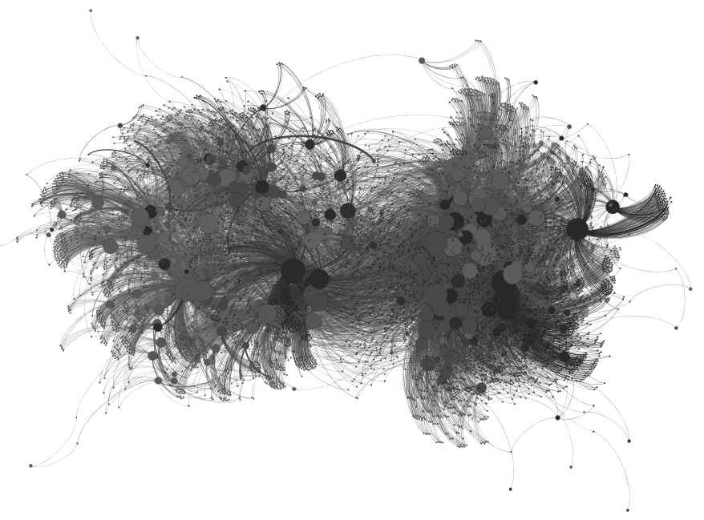

---
output:
  pdf_document:
    keep_tex: true
    fig_caption: true
    latex_engine: pdflatex
    template: ../svm-latex-ms.tex
title: "Political Donor Motivations and Public Support of Policies: A Time Series-Analysis"
thanks: ""
author:
  - Ross Dahlke
affiliation: Stanford University
abstract: "The two predominant theories of political donor motivations are the access-oriented model and the consumption model. This paper combines political donation records and social media posts from politicians to test whether either behavior is observed. In the access-oriented model, individual political donors and political action committees (PACs) are assumed to contribute to campaigns in an effort to acquire access and influence politicians into supporting specific policy issues. In this study, the access-oriented model of donors predicts that donations from specific groups of donors will precede public support of certain policies. The consumption model of donors views political contributions as being an extension of voting along a participatory spectrum, and that donors support candidates who they already know support policy issues that the donors care about or are ideologically motivated. In this research, the consumption model predicts that donations from various groups of donors will lag in response to public support of certain policy issues. Historically, these two models have treated political donors as all having the same motivations. More recent studies in campaign finance have found that both motivational models can exist in different groups of donors. However, these studies categorize groups of donors in broad strokes, generally as either small-dollar donors and large-dollar donors as well as PACs. This paper statistically derives coalitions of similar donors and tests the competing models of political donor motivations on these more granular groups of donors who support similar candidates. "
keywords: ""
date: "`r format(Sys.time(), '%B %d, %Y')`"
geometry: margin=1in
fontfamily: mathpazo
fontsize: 12pt
spacing: double
bibliography: bibliography.bib
biblio-style: apsr
header-includes: \usepackage{graphicx}
---

```{r echo = F, message = F}
knitr::opts_chunk$set(include = F, echo = F, warning = F, message = F)
library(tidyverse)
```

\newpage

# Introduction

The amount of money raised and spent by political campaigns in the United States continues to rise with each election cycle [@goldmacher2020]. However, the explanations of the motivations of political donors, the psychological reasons why political donors decide to make a contribution, remain divided. The predominant theories of political donor motivation fall into two broad categories, the access-oriented model or the consumption model. In the access-oriented model, contributions are given in exchange for access and political favors that presumably materialize in altered government policy. The consumption model of donations sees donors as participants in the political process who seek to alter election probabilities in a way that helps one's preferred campaign, similar to how voting seeks to help a campaign achieve election. 

The prevalence of the two theories in political science literature changes throughout time. In the twentieth century, the bulk of academic inquiry into the motivations of political donors focused on the access-oriented model, particularly around Political Action Committees (PACs) and interest group politics [e.g., @herndon1982]. In the early- to mid-2000s, political scientists shifted their focus to and found evidence of the consumption model of donor motivations [e.g., @ansolabehere2003]. In response to the _Citizens United_ U.S. Supreme Court case in 2010, research focus again shifted back to the effects of the increased amount of money being donated to political campaigns and causes [e.g., @fouirnaies2018]. This study does not take a zero-sum view of the motivations of political donors. Instead, the two predominant models are both investigated and allowed to exist together. While much of the research history of political donor motivations has either pitted the two models of motivation against one another [@welch1980] or operated exclusively in the domain of one and not the other [@fellowes2004], recent scholarship has developed a more nuanced view of the motivations of political donors in that they are not a monolith and different donors can have different motivations.

This emerging, more nuanced view on the motivations of political donors is that donors are unique actors. Different donors may have different motivations, intents, and goals in making a political contribution. This recent scholarship has divided political donors into different groups and studied the two models, access-oriented and consumption, within these different groups. One way to divide political donors is into PACs versus individuals, with PACs' behavior being inline with the access-oriented model and individuals broadly being found to exhibit behavior consistent with the consumption model [@barber2016a]. Another way to group individual donors is into frequent or infrequent donors, with frequent donors having been found to be access-oriented where infrequent donors are consumption-oriented [@heerwig2016]. Even more granularly, individual donors can be characterized into further specific descriptive categories with different categorizations showing different types of motivation for making a contribution [@rhodes2018].

This paper employs a novel clustering approach to find statistically similar political donors and layers in politicians' social media data to advance our understanding of the distinct motivations of political donors, including the policy issues that may motivate them to make a contribution. Instead of making a descriptive distinction between donors, such as PACs versus individuals [@barber2016a], frequent versus infrequent donors [@heerwig2016], or other heuristics [@rhodes2018], donors are clustered together based on their network connections. This type network-based approach has started to emerge among computer science and machine learning researchers [@wahl2018] who then make descriptive summaries of the statistical communities. We add a theoretical political psychological component to this approach by layering in an additional unique dataset, social media data from politicians, to identify behaviors and potentially the underlying reasons why donors are in the same statistical community. This paper combines these two datasets to test theories of motivations in clusters of political donors.

In a network-based approach, donor clusters act as a _latent coalition_ where different coalitions can have a distinct motivation. Previous network studies have concluded that this type of network clustering has been highly predictive for other types of political analysis, including voting behavior in the U.S. House of Representatives and Senate [@wahl2019]. Instead of focusing on the clusters in the campaign finance networks that legislators belong to, this study examines the donors themselves and their statistically-derived clusters. This paper's approach in using latent coalitions of donors continues down the granularity spectrum established by other political donor researchers in parsing out the motivations of political donors. 

```{r include = F}
# For example, a contributor may only make a single donation. That single donation may not have a statistically-identifiable influence on politicians, but if that single donor is acting in concert with other donors, there is a potential for identifiable results. For example, under an access-oriented/ influence model of donor motivations, this single donor could be a member of a pro-environment interest group. If many members of this group give individually to a candidate, the coalition could exhibit influence over that campaign to become more pro-environment. Similarly, under a consumption/ ideology model of motivation, a candidate could come out with a strong pro-environmental message and many members of the coalition could be attracted to the message and reward the pro-environment stance taken by the campaign. 
```

In addition, this paper adds a dimension of policy issues. Are there certain policy issues that have donors who exhibit behavior inline with the access-oriented model or consumption model? Hypothesizing different issues are related to different groups of donors, this paper also considers policy-specific motivations. Most research into the motivations of political donors focus on ideological proximity instead of specific policy issues [@ensley2009], or specific policy motivations are briefly discussed but not the focus of the paper [@bonica2014]. But when they are the focus of the paper, individual-policy preferences are an integral component of the campaign finance system [@bonica2019]. For example, perhaps pro-environmental donors are driven by the access-oriented model and anti-abortion groups are driven by the consumption model of politics. This paper combines donation records with social media data collected in Wisconsin during the 2016 election cycle to measure whether campaigns' support of certain policy issues respond to donations from clusters or whether donations from coalitions respond to public support of policy issues. Previous studies have used social media posts as a proxy for public appeals and the connection these appeals have to fundraising [@fu2020]. Particularly with the rise of politics online, adding in social media data provides a valuable variable in understanding the information ecology that political donors experience and how the information ecology relates to their donation motivations. The results of this paper suggest that public support of policy issues on social media is both a valuable predictor of, and can be predicted by, political donations from coalitions of donors. 

Next, we discuss the literature on the access-oriented and consumption model of political donors and explain the hypotheses for this study that can be derived from the two theories. Then, we will discuss the methods and results, followed by a discussion of the findings.

# Access-Oriented Model

Access-oriented political donors are those that attempt to use their contributions to gain access to politicians. Most often, access-oriented motivations are thought to be the reason behind contributions from Political Action Committees (PACs) and donors with business interests. The theory goes that this access can then influence legislative behavior [@francia2003]. The process of influencing legislation is fundamentally a communicative process where those seeking to influence legislators must be able to have direct access to legislators to whom they can take their arguments [@milbrath1958]. 

Congress is an information ecology where competing facts and perspectives are everywhere and changing at all times. Political contributions can gain direct access that allows one to cut through all the noise of competing information that the legislator might be encountering [@milbrath1958]. Interviews [@herndon1982], surveys [@baker2020a], empirical studies of financial documents [@fouirnaies2015], and contribution patterns themselves [@powell2016] all support the conclusion that interest groups and individuals have the goal of gaining access to politicians through their financial contributions in order to influence government policies. These attempts to buy access are successful in gaining meetings with congressional offices for both special interest groups [@langbein1986] and individual donors [@kalla2016].

Measuring the direct access that political financiers gain from political contributions can be a challenging endeavor due to all of the noise in the political ecology. Instead, researchers have treated the "access" component of contributor influence as an implicit assumption and instead look for evidence of "influence" of political contributors on politicians. Many political science papers do not use the explicit term "access-oriented donor" and instead refer to their work as examining the potential "influence" of political donors on politicians. This line of influence research inherently implies a gain of access by political contributors. In order to have influence over public policy, one must first have access to politicians in order to communicate with them because the contribution itself does not carry any intrinsic message [@langbein1986]. In other words, studies that examine the influence of political donors make the assumption of the access-oriented model because influence requires access.

Even though research has suggested there is a connection between political contributions and access, it is unclear if that access actually converts to _influence_ in the political process. PAC contributions have a limited effect on roll-call voting [@wright1985] with about one-third of roll-call votes being impacted by campaign contributions [@roscoe2005]. In these instances, there is an apparent connection between PAC contributions and roll-call votes, but that correlation is potentially due to broader support from larger interest groups [@grenzke1989]. These correlations could be a manifestation of legislators responding to changes in the opinions of the national individual donor class [@caneswrone2019]. One article went so far as to conclude that "evidence in the article undermines belief in the military-industrial complex model" [@wayman1985] when studying the effect of defense-related PACs on roll-call voting. 

Other lobbying efforts, beside political contributions, can also impact politicians' behaviors. Donations are just a piece of the broader lobbying effort when trying to influence legislation. Ideologically extreme groups, particularly very liberal groups, are more reliant on PAC contributions than other lobbying methods compared to other interest groups [@mckay2010]. These other interest groups can alter the legislators' perceptions of the power of the interest group, for example, union membership rates [@finger2019] which can factor into whether contributions can acquire influence. 

Contributions from financial [@hayes2017], telecommunications [@edwards2016], education [@constant2006], environmental [@hogan2020] and healthcare interest groups [@mckay2018] have all influenced legislation. Any connection that does exist between campaign contributors and public policy has a stronger impact if the contributions are from organized business interests within a member's district [@hall1990], potentially similar to how members of congress prioritize public opinion of their district over national public opinion [@butler2011]. Further, there is a stronger influence as a result of contributions from individuals with business interests, opposed to PACs, which many other studies focus on [@fellowes2004]. While it is "nearly universal" [@bonica2016] that corporate executives of Fortune 500 firms make political contributions, and there is a significant increase in contributions once the business people are promoted to executive status [@fremeth2013], there is heterogeneity in their political leanings [@bonica2016]. Individual executives all have unique reasons and motivations for contributing to political campaigns. 

Potentially, the influence exerted by contributors when making a political contribution is so indirect that it doesn't always materialize in statistical patterns of legislative voting or public policy, but there is evidence of the influence towards the benefit of the financial contributor. Interest groups seek both direct and indirect access to the policy making process [@fouirnaies2018]. Firms that contribute to winning political campaigns have abnormal financial returns after the election [@akey2015; @cooper2010]. In addition to immediately-felt financial returns, donors may systematically contribute money to legislative agenda setters, such as chairs of financial committees, in an effort to set future legislative agendas [@fouirnaies2018]. Even business executives understand that political contributions are purchases of "good will" which are positive in return but are not frequent nor universal [@gordon2007]. For example, political contributions reduce the punishment for business executives who are sanctioned for committing fraud [@fulmer2017]; increase the number of "sweatheart" contracts rewarded from the government [@ferris2019]; and increase the premium and survivability of Initial Public Offerings (IPOs) [@gounopoulos2021].  

There is still only a weak relationship between public policy outcomes and political contributions [@hadani2017]. This weak connection may be more of a signalling of policy preference than anything else [@austensmith1995], in which case the assumption that a contribution itself does not carry a message [@langbein1986] may have to be reassessed. In addition, this signalling is likely only effective if the contribution is large enough to influence the likelihood of the candidate being elected [@schnakenberg2021]. 

Instead of focusing on direct access or financial outcomes, this research article examines politicians' public support of policy issues. Under the access-oriented/ influence model of political donor motivations, we would expect to find politicians to be more supportive of certain policy issues after receiving campaign contributions from access-oriented donors. This hypothesis will be tested using a Granger causality model [@granger], which is an econometric methodology to test whether changes in one time series predict future changes in another time series. 

**$H_{1}$: Donations from various coalitions of political donors will precede, or Granger cause, increased public support of certain political issues from the politicians to whom they donate.**

Since access-oriented donors are thought to be wealthier contributors, sometimes seeking access for financial gain, this paper will also examine the amount contributed by members of donor coalitions that are accepted by $H_{1}$. 

**$H_{2}$: Donors from access-oriented coalitions will on average be _larger_ contributors to political campaigns than donors not in access-oriented coalitions.**

# Consumption Model

While the access-oriented model is centered on donors _influencing_ the political process, the consumption model is about donors _participating_ in the political process. The consumption model of political donors concludes that political contributions are not vehicles by which donors seek access to politicians but instead are acts of consumption, or in other words, participation [@ansolabehere2003]. Under this model, individual donors are intrinsically motivated by ideology [@ansolabehere2003]. People don't receive a direct benefit from making a political donation, but they do experience the indirect benefits of participating in a political campaign that matches their ideology and excites them. Said another way, for consumption-motivated donors, making a contribution is just an extension of voting on a participatory spectrum. Under this approach, donations are a way for individuals to participate and be responsive to their "perception of the stakes in the election" [@hill2017]. 

Ideological proximity, or the spatial distance between the ideology of candidates and donors, is an important component to the consumption model of political donors, [@ensley2009], even more so than agreement between the donor and the candidate on specific policy issue positions [@barber2019], such as taxes, global warming, and gay rights. The similarity between a donor's policy preferences and a senator's roll-call votes is a predictor of whether a donor makes a contribution [@barber2017]. It is unclear if this connection between contributors' policy preferences and legislators' votes holds historically or only recently [@caneswrone2019]. Divergence of ideology among the candidates for an office, such as a more extreme political opponent, does not impact donors' decisions to make a contribution [@ensley2009]. Out-of-state donors display policy-specific motivations in an effort to acquire surrogate representations [@baker2020b]. The theoretical implications for this paper are that consumption-oriented donors will contribute to politicians who already show support for the policy issues, or are ideologically proximate, to themselves. In other words, donors reward for policy proximity between themselves and candidates.

In addition to individual donors, PACs also sometimes display behavior that can be defined as consumptive. For example, PACs for organized labor unions reduce contributions to members of the U.S. House of Representatives when they supported the North American Free Trade Agreement (NAFTA) [@engel1998], showing that labor PACs responded to perceived changes in ideological proximity of the policy issues they are about opposed to doubling-down on their efforts to potentially influence legislators who have become estranged from the PAC's priorities. While labor unions sometimes "punish" legislators for their votes [@jansa2018], this punishment is to coax incumbents into changing their position back to being pro-labor [@jansa2019], suggesting that there might actually be some influence-buying. Other PACs also show behavior that is inline with the consumption model of political donor motivations where PACs contribute to politicians who already agree with their policy preferences [@goldberg2020] as opposed to coercing a future vote on relevant policy topics [@callahan2019]. Contributions from PACs and individuals that exhibit consumption-oriented behavior are a lagging indicator of politicians' ideology and support of policy issues. Individuals and PACs make contributions between the politicians they are donating to are ideologically proximate to them or support similar policies. These donors reward ideologically proximate politicians, respond to changing ideological spatial location of the politicians, and do not try to necessarily influence policy stances into the future.

All together, under the consumption model of donor motivations we would expect public support of policy issues to attract political donors who care about that policy, which leads to $H_{3}$.

**$H_{3}$: Public support from politicians on certain political issues will precede, or Granger cause, donations from various coalitions of political donors.**

Individual donors, as opposed to PACs, continue to make up a clear majority of donations to political candidates [@heerwig2016]. These individual donors most often exhibit behavior consistent with the consumption model of donations [@barber2016a; @heerwig2016]. Further, individual donors arguably play an even more central role in politics more recently with the growth in small-dollar individual donors. 

With the rise of small-dollar donors on the internet and the assumption that these small-dollar donors are motivated by the consumption model of donor motivations, this paper will examine the amount of money contributed by members of donor coalitions that are accepted by $H_{3}$. $H_{4}$ also serves as a measure of face validity for the theory of the consumption motivation model of political donors and this study's measurement.  

**$H_{4}$: Donors from consumption coalitions will on average be _smaller_ contributors to political campaigns than donors not in consumption coalitions.**

# Rise of Small-Dollar Donors

The growing number of small-dollar donors in the political process suggests that there will be more consumption-oriented donors in the future. The anecdotal examples of the Bernie Sanders and Donald Trump presidential campaigns, both of which received a large number of small-dollar donors [@choma2020], illustrate the consumption-oriented model's connection to small-dollar donors. Small-dollar donors likely did not directly access or influence the politics of the Sanders or Trump campaigns. Instead, donors reacted to their messages and decided to move further down the participatory spectrum in those campaigns. Individual contributors are mostly all participants in politics without an ulterior motive besides wanting to support the campaign they are contributing to. Individual donors are "fickle financiers of elections" whose donation habits can be disrupted by little changes to their worlds such as moving to an area that is more or less Democratic or Republican [@kettler2019].

The Democratic Party as a whole has recently grown its proportion of money that is coming from small-dollar donors [@albert2020]. Incumbents have been able to sustain their small-dollar fundraising programs [@heberlig2020]--suggesting that this trend is not going to go away. This growth in small-dollar donors has created a donorate that is more demographically representative of America but is more ideologically extreme [@albert2020] and give indiscriminately to incumbents, challengers, and open seat candidates [@culberson2019]. It is conceivable that campaigns that rely on small donors will adopt rhetoric and tout their "outsider" status in an effort to activate these small, more ideologically extreme donors [@arbour2020]. Extremist politicians can leverage polarizing events to raise more money for their campaigns [@oklobdzija2017]. As a result, some have predicted that small-dollar donors will polarize the nation's politics even further [@oklobdzija2017]. Although legislators who receive a large number of small-dollar donors aren't more polarized in their voting in the next legislative session, legislators taking up a more polarized agenda does increase the number of small-dollar donors they attract in the subsequent election [@keena2019], providing further evidence for the consumption model of political donor motivations. Other studies have agreed that mass donors are the cause of partisan polarization [@laraja2012], but this conclusion is not definitive [@harden2016]. And so, even though small-dollar donors themselves may not be polarizing, they may provide incentive for politicians to take more polarized positions.

This research paper will also examine the polarization of political donor coalitions and whether consumption-oriented donors and access-oriented donors are in polarized positions in the donor network graph. 

**$H_{5}$: Consumption-motivated donors will be more polarized in the political donor network than non-consumption donors.**

**$H_{6}$: Access-oriented donors will be less polarized in the political donor network than non-consumption donors.**

This inquiry is not at all meant to make causal claims, as much of the literature does. These two hypothesis will address whether donors are _causal_ or _reactive_ to polarization. Instead, this research hopes to add data as to whether this line of thinking is validated in descriptive data.

The rise in small-dollar donors has been driven primarily by technological advancements [@albert2020] including growing sophistication with big data analytics [@walker2018], particularly in modeling political behaviors of individuals [@nickerson2014]. Digital firms, including Facebook, Twitter, and Google embed themselves into political campaigns and serve as "quasi-digital consultants" to the campaigns that shape the "digital strategy, content, and execution" of campaigns [@kreiss2018].  Along with virtually every other component of political campaigns, fundraising, especially from small-dollar donors, is moving online [@chester2017]. While scholars remain skeptical of the power of data analytics on political campaigns, firms have successfully cultivated their images and businesses around the role of advanced data methods on political campaigns [@simon2019].

# Online Fundraising

The field of non-profit organizational studies [@hazard2003; @marx2000; @miller2009; @raihani2015], and not political science, has historically done the most research into online fundraising. The few studies that have researched the connection between social media posts and political fundraising have found a connection between the two [@wang2020]. Before political scientists studied the digital world and donations to campaigns, the internet was seen more broadly as an agora public discussion [@anduiza2010; @degennaro2006; @dezuniga2009; @valenzuela2011; @vesnic2012], a hub of political organizing [@cogburn2011; @jost2018; @levenshus2010], and a useful predictor of offline political capital [@zuniga2012; @hardina2005].

Digital communication methods are similar to traditional political communication and can be extrapolated to offline characteristics. The differences that are seen in online political communication, like lowered costs and eased barriers to entry, represent a "difference-of-degree" and not a paradigm shifting "difference-in-kind" [@karpf2010]. There is a strong connection between online channels of communication in the form of social networks and offline connections and building and maintaining social capital from those offline connections [@cranshaw2010; @ellison2006; @liben2005; @scellato2010]. Online social networks have also been used to study offline-based actions and beliefs like opinion polarization [@lee2014], political polarization [@hanna2013], political participation [@lawrence2010] and political discourse [@kushin2009].

The bottom line is that online actions and behaviors reflect the offline world, and the online world is frequently extrapolated to explain offline actions and behaviors by prior researchers. This study builds upon these previous uses of online indicators of offline actions and beliefs by combining political administrative records of political donations and politicians' social media accounts to discern the relationship between political donations and public support of policy issues. 

Using social media will allow this paper to analyze the textual and linguistic characteristics of the posts. Previous research has been able to study the connection between digital language and political behaviors such as protests [needcite] but not donations. This paper will be able to use the connections found in $H_{1}$ and $H_{2}$ to explore textual features, specifically political sophistication [@benoit2019] and polarizing language [@goet2019; @lauderdale2016], to see if different types of language are related to either being influenced by donors in the access-oriented model or attracting donors in the consumption model.

**$R_{1}$: Do social media posts from politicians that either Granger cause or are Granger caused by donations from coalitions of donors have unique textual characteristics?**

$R_{1}$ remains a work-in-progress and will not be answered in this working paper.

# Data

Data for this research come from two primary sources: politicians' social media posts and political donation data. 

For social media posts, this paper used the Facebook [@rfacebook] and Twitter [@rtweet] APIs to collect social media posts from all candidates for the Wisconsin State Senate and Wisconsin State Assembly during the 2016 election cycle (_n_ = 82,851). A subset, 12,364 posts, or about 15% of the total posts collected, were hand-coded into 27 topical categories. These topical categories included if the post was made in support or opposition to a policy. For example, there is a "voting liberal" category that contains posts that are supportive of repealing voting ID laws and expanding early voting. The category "voting conservative" are posts that are in support of voter ID laws and other conservative voting reforms. Another example is that posts about healthcare were categorized into three different topics: liberal, conservative, and bipartisan. 

These 12,364 posts were used to train and test a BERT deep learning transfer model. Of these 12,364 posts that were hand-coded, about 90%, 11,128 were used in the training set and about 10%, 1,236, were used in the test set. This trained model achieved about 82.9% accuracy in categorizing the topic of posts in the test set. This model was applied to the rest of the uncoded corpus that were later used for aggregations and calculations of the topics that politicians were posting about.

BERT, which stands for Bidirectional Encoder Representations from Transformers, is a pre-trained deep learning model that allows researchers to add just an additional output layer, in this case the hand-coded topical categories of the social media posts, onto a large pre-trained neural network [@bert]. BERT is currently the state-of-the-art model and performs at the cutting-edge of Natural Language Processing [@bert]. BERT and other transfer learning models have yet to be widely adopted by political scientists, but are an ideal choice for political science text classification, especially when compared to traditional text-as-data methods in the discipline [@terechshenko2020]. BERT has been applied to other social media research such as the detection of propaganda [@vlad2019], misinformation [@jiang2020], hate speech [@mozafari2020], stance [@tian2020], and aggression [@ramiandrisoa2020].

Political donation data for all candidates to the Wisconsin State Legislature during the 2016 election cycle were collected from the Wisconsin Campaign Information System (CFIS). Anonymous contributions were removed, names were made uniform (removed punctuation, made all names lowercase, etc.), and OpenRefine [@openrefine] was used to stem names to identify people who might be the same person (e.g., Jim Smith and James Smith). To ensure that people who have the same name, but are different people, were not counted as the same individual, their zip code was added to the end of their name to create a unique identifier. Finally, only contributions from donors who contributed to more than one campaign were used. This filtering was done for computational efficiency and also because there were many donors who only made a single contribution which resulted in unequal, and computationally unusable, clusters. These steps left [neednumber] donations. 

These donations were used to create a network of political donations with candidates and donors serving as nodes and donations between them as edges. This network was clustered into 13 distinct communities so that donors in each community are most similar to one another based on which campaigns they contributed to. The Louvain method as implemented by Gephi [@gephi] did the clustering, or community detection. The rest of the analysis used these clusters assigned to the donors and are referred to as coalitions, communities, or clusters that donors belong to. 

This network is visualized in Figure 1 using the Yifan Hu layout algorithm [@yifanhu] with the two political parties clearly divided with Democratic donors in the left large group of donors and Republicans on the right. The graph is shaded by the statistical community the donor and candidates are in. 



# Methodology

$H_{1}$ and $H_{3}$ test the relationships between the social media dataset and the political donation dataset. A Granger causality time-series model was used to test the two models of political donor motivations. Other social media studies have used this methodology [@freelon2018; @lukito2020]. Similar to political donations, this methodology has been used to study the relationship between social media and non-social media events such as offline protests [@bastos2015] and stock prices [@park2017]. Granger causality detects whether movements in one time series precedes, lags, has a confounding variable, or is not related to another time series [@granger]. An abbreviated version of how this methodology works is that one takes two time series variables X and Y. First, a vector autoregression (VAR) model is built to predict the outcome variable Y with Y being the sole predictor of the model. In other words, one only uses Y to predict Y. Then, a second model is built where both variables X and Y are used to build the VAR to predict Y. Effectively, if the second model, with the inclusion of X, does a better job of predicting Y than the first model alone, as measured by an _F_-statistic, X is said to Granger cause Y. The two variables, X and Y, are also flipped and the same process is done. If the null is rejected in both instances, then there is likely a confounding variable Z. This analysis was conducted in R [@r] with the `lmtest` package [@lmtest]. P-values were adjusted with the Bonferroni method [@bonferroni]. The optimal lag for each model was calculated using a Bayesian Information Criteria [@bic] implemented by the `tsDyn` package [@tsdyn].

We compare time series of donations from clusters of political donors and time series of the number of social media posts by each topic that were made by campaigns that each donor cluster contributed to. In other words, a time series of donations from a donor coalition was compared to the aggregate count of posts about a given topic made by candidates that the donor cluster contributed to. For example, donations from donor coalition 6 Granger caused politicians that received donations from the coalition to publicly support women's issue and pro-choice policies. Stated another way, donations from coalition 6 predict whether candidates will publicly support pro-women policies. The theoretical connection to political donor psychology is that this behavior is expected under the access-oriented model of political donor motivations. Coalitions and policy topics that are accepted by either $H_{1}$ or $H_{3}$ are in Table 1. The full results of the Granger causality tests are visualized in Figure 2. 

```{r include = T}
read_csv("../data/granger_results.csv") %>% 
  filter(result != "no relationship") %>% 
  mutate(f_statistic = round(f_statistic, 1),
         p_value = if_else(p_value < .001, "<.001", as.character(p_value))) %>% 
  knitr::kable(col.names = c("coalition", "policy topic", "model", "BIC", "F-statistic", "p-value"),
             caption = "H1 and H3 acceptances")
```


These results were used to test $H_{1}$ and $H_{3}$. Donor coalitions and the topic of social media posts that were accepted by $H_{1}$ and $H_{3}$ are listed in Table 1. Coalitions of donors that were accepted by only $H_{1}$ or $H_{3}$ were used to test $H_{2}$ and $H_{4}$ with a difference-in-means permutation test since the statistical assumptions were not met for an OLS regression. Results to $H_{2}$ and $H_{4}$ are in Table 2.

To study the polarization of consumption-motivated donors, we extract the x-coordinate position from the donor network (Figure 1). We then rescale the coordinate position to be -1 to 1 with -1 representing the left-most, or most Democratic, node and 1 representing the right-most, or most Republican, node. To test $H_{5}$ and $H_{6}$, a difference-in-means permutation test on the absolute value of the rescaled x-coordinate with the coalition category as a variable. A non-parametric permutation test was used since the statistical assumptions for an OLS regression were not met. This absolute value effectively is the level of polarization in the graph, with the nodes that are on the extremes of the graph being closer to 1 and the central-most nodes, representing bipartisan donors, being closer to 0. Results for $H_{5}$ and $H_{6}$ are in Table 3.

# Results

We find evidence that supports the recent scholarship into the motivations of political donors that maintains a nuanced view into the psychology of political contributors: different donors hold different motivations. Different donor coalitions exhibited behavior that is inline with both the access-oriented and consumption model of political donations with policy issues across the ideological spectrum of liberal, conservative, and bipartisan. Example social media posts of the various topics can be found in the appendix. 

# Access-oriented Coaltiions

For three donor coalitions show behavior consistent with the access-oriented model where we can predict politicians' public support of policy issues after they receive contributions from these donor groups. For these three groups and policy issues $H_{1}$ is accepted. These access-oriented coalitions represent 1,572 individual donors or 21.3% of all donors in the dataset; 6,489 individual donations or 22.4% of donations; and $654,577.60 or 16.5% of dollars contributed. Each of these three coalitions appear to have unique policy and even ideological positions that they support. 

## Race Issues

Donations from donor coalition 3 Granger caused politicians they contributed to to talk about liberal policies on race. Some social media posts talk about broader cultural issues as they relate to race (appendix example 1) and others discuss evidence and propose policies to address racial issues (appendix example 2). Race was a big part of the 2016 presidential campaign, and racial issues were also a topic in this dataset. This coalition contains 423 donors or 5.7% of all donors in this dataset.

## Pro-life 

Coalition 6's donations predicts politicians' support for conservative policies on abortion and women's health, pro-life policies. Some posts explicitly talk about pro-life organizations and the politicians' support of those organizations, other posts talk about specific policies and where the legislative process, and others still are campaign-oriented appeals that use more coded language that the BERT model was still able to pickup on (appendix examples 3, 4, and 5, respectively). Pro-life policies are a perennial topic in Wisconsin elections. This donor coalition is one of the smaller clusters of donors with only 252 donors or 3.4% of donors. 

## Veteran's Issues

The final access-oriented group of donors, coalition 1, have donations that precede politicians posting about bipartisan veteran's issues. Veteran's issues were particularly salient during the 2016 election in Wisconsin with Veteran's Affairs hospitals, specifically the Tomah, Wisconsin VA Hospital and one Wisconsin-run housing complex, Wisconsin Veteran's Home At King, receiving a lot of public attention for poor management and other issues. Both Republicans (appendix example 6) and Democrats (appendix example 7) publicly supported various policies and initiatives aimed to assist veterans. This coalition contains the second most donors, 897, or 12.1% of all donors.

# Consumption-oriented Coalitions

In addition to these three access-oriented clusters of donors, five coalitions of donors exhibit behavior that one would expect under the consumption model of donor motivations and are accepted by $H_{3}$. In other words, public support of various policy issues from campaigns predicts donations from these coalitions. The five consumption-motivated clusters of donors contain: 2,702, 36.7% of donors; 11,080, 38.4% of donations; and donated a collective $1,341,129.70 or 33.8% of money contributed. Similar to access-oriented clusters, consumption-oriented coalitions show significant relationships to policy issues across the ideological spectrum.

## Pro-gun

One consumption-oriented group, coalition4, shows a relationship with conservative gun-related policies where pro-gun public support Granger causes donations from this group. In other words, donations from this coalition of donor can be predicted by politicians publicly supporting conservative gun-related policies. Social media posts that are categorized as being supportive of conservative policies on gun-related issues range from talking about their relationship to pro-gun interest groups (appendix example 8) as well as specific policies (appendix example 9). This coalition is medium-sized with 605 donors or 8.2% of the total donors.

## Infrastructure and roads

In addition to a conservative consumption-oriented group, coalition 11 is a group of donors consumptive group of donors whose donations can be predicted by politicians publicly supporting liberal measure on public infrastructure and roads. Most of these posts are either general support of public infrastructure improvements (appendix example 10) or targeted Republican Governor Scott Walker and Republicans over roads containing a large number of pot holes (appendix example 11). There are 395 donors in the coalition or 5.4% of donors.

## Veteran's Issues & Drug Abuse

Two different bipartisan policy issues Granger cause donations from two different coalitions. Coalition 0 (377 donors, 5.1% of donors) has a consumption-oriented relationship with politicians' support of veteran's issues. This topic, veterans issue, had a different coalition of donors that display an access-oriented relationship with the topic. Both a consumption-oriented and an access-oriented group displaying a relationship to the same topic is noteworthy. In addition, the donor coalition that showed the access-oriented relationship to veterans issues, coalition 1, also exhibited a consumption-oriented relationship to another bipartisan issue, drug abuse. While it is just a singular example, this datum suggests that political donors can have different motivations with different policies, for example, they can be access-oriented on veterans issues and consumption-oriented on drug abuse issues. Another coalition of 428 donors, representing 5.8% of donors, also had a significant consumptive relationship with drug abuse. Most posts about drug abuse focused on the opioid and heroin epidemic across Wisconsin (appendix example 12). The implications of these statistical patterns are addressed further in the discussion section.

# Donor Sizes

Neither the access-oriented donors nor the consumption-oriented donors contributed statistically significantly different amounts of money than donors that were donors that were not only access-oriented and not only consumption-oriented. The outputs of the bootstrap used to test $H_{2}$, that access-oriented donors are on-average larger donors, and $H_{4}$, that consumption-oriented donors are on-average smaller donors, are in Table 2.  Both $H_{2}$ and $H_{4}$ are not accepted. This finding is discussed in the next section of the paper.

```{r include = TRUE}
tibble(hypothesis = c("H2", "H4")) %>% 
  cbind(read_csv("../data/contribution_size_permutation.csv")) %>% 
  mutate(ci = paste0(round(lower_ci, 2),"-",round(upper_ci, 2)),
         mean_diff = round(mean_diff, 2)) %>% 
  select(hypothesis, model, mean_diff, ci, p_value) %>% 
  knitr::kable(col.names = c("Hypothesis", "Model", "T", "95% CI", "p-value"),
               caption = "Difference in Average Donor Size")
```

# Donor Spatial Positions

Consumption-motivated donors are on average in more polarized positions (further to the left and right of the graph) than non-consumption-oriented donors, and access-oriented donors are on average in less polarized positions (closer to the middle of the graph) than non-access-oriented donors. Table 3 shows the output for $H_{5}$, that consumption-oriented donors are more polarized in the network graph, and $H_{6}$, that access-oriented donors are less polarized in the network graph. Both of these hypotheses are accepted. These results are discussed further in the next section.

```{r include = TRUE}
tibble(hypothesis = c("H6", "H5")) %>% 
  cbind(read_csv("../data/contribution_polarization_permutation.csv")) %>% 
  mutate(ci = paste0(round(lower_ci, 2),"-",round(upper_ci, 2)),
         mean_diff = round(mean_diff, 2),
         p_value = if_else(p_value == 0, "<.001", as.character(p_value))) %>% 
  select(hypothesis, model, mean_diff, ci, p_value) %>% 
  arrange(hypothesis) %>% 
  knitr::kable(col.names = c("Hypothesis", "Model", "T", "95% CI", "p-value"),
               caption = "Difference in Average Donor Position Polarization")
```

# Discussion

The analyses conducted in this paper show that multiple models of political donor motivations can exist within different coalitions of political donors. Historical studies on the motivations of political donors have explicitly reasoned or implicitly assumed that donors hold monolithic motivations--all donors are motivated by the same psychological processes. The results of this paper contrast this historical principle and instead is in agreement with the recent line of donor studies which take a more nuanced approach to political donors. 

While much of the popular concern over money in politics is around access-oriented donors manipulating the political system, we find that there are more consumption-oriented donors than access-oriented donors. There are more consumption-motivated groups of donors than access-oriented donors, five groups compared to three, respectively. These group consumptive groups also represent more people (2,702 versus 1,572), donations (11,080 versus 6,489), and total amount contributed (\$1,341,129.70 versus $654,577.60). While any number of access-oriented donors may remain concerning to some in the public, these results suggest that more people use political donations as a vehicle for increased participation, not manipulation, of the political process. 

The folk theory of political donors is that of access-oriented donors with financial interests donating large sums of money to politicians, but the results of $H_{2}$ reject this idea. Donors in access-oriented coalitions do not contribute statistically significantly more money on average than other donors. Just because a donor is not contributing a large sum of money themselves does not mean that they are not seeking to coax a politician into supporting specific policies. This effect can be amplified when coalitions of donors operate in conjunction with one another. For example, members of an interest group could each contribute a relatively small amount of money, but in aggregate, the unified donations could potentially gain that interest group access to a politician. If anything, donors that are labeled in this study as being in an access-oriented cluster potentially donate less money than other donors, but this non-statistically significant result with a relatively large confidence interval is not conclusive. A future study could replicate this analysis with multiple election cycles or study multiple states or federal elections to achieve higher statistical power. The converse is found for consumption-oriented donors.

The folk theory of consumption-motivated donors is of small-dollar donors whose contributions can be harnessed online. Similar to access-oriented donors, $H_{4}$ is rejected and consumption-motivated donors are not on average smaller donors than other contributors. Again, these results suggests a disaggregation between the notion that the amount of money one contributes is indicative of one's motivations. If someone is able to to contribute a large sum of money and they care about a certain issue, it stands to reason that they may just support campaigns who already care about that issue. If contributions to campaigns are similar to financial investments, the equivalent is someone investing in a company because they believe the company will do well in the future, not because every time someone invests in a company they expect to be able to tangibly alter the direction of the company. While there are certainly activist investors, they are well outnumbered by the amount of people who are not activist investors, even among wealthy individuals. This paper challenges conventional beliefs on the size of access-oriented versus consumptive donors, but it does concur with the literature on the levels of polarization among donors.

Consumption-motivated donors are in more polarized spatial positions within the donor graph than non-consumptive donors, and access-oriented donors are more centrally located. The acceptances of $H_{5}$ and $H_{6}$ are in agreement with past literature. These results provide descriptive context and are not meant to imply any level of causality. Past studies have either suggested or found a connection between donor motivations and political polarization, and this study also finds these descriptive relationships. Future studies should examine the causal mechanisms of these relationships. Do candidates take more polarizing stances in an effort to court consumptive donors? Has an increased number of consumptive donors helped more polarized candidates to win office? Do access-oriented donors seek out campaigns that are more moderate? Or can access-oriented donors influence the ideological extremity of candidates?

In addition to the finding that both the access-oriented and consumption motivational models can exist in different donor coalitions, one of the thirteen donor clusters, coalition 1, revealed a duality where they were access-oriented in relation to one policy issue and consumption-oriented to another. While it is possible that this finding is spurious, there is additional face validity in this finding because the two issues the donor coalition had a relationship with were both bipartisan issues--veterans issues and drug abuse. Not many studies have come to the conclusion that donors can operate with both motivational models. While this study finds this behavior to be relatively rare, in only one donor cluster, it does open up the possibilities to an even more complex view as to why donors make a political contribution. Further, public support of one policy issue, veteran's issues, is both Granger caused by donations from a coalition and Granger causes another coalition to make a contribution. This result suggests that issues can play different roles to different groups of political donors. One group of donors can seek access in order to influence that policy, and another group can display consumptive behavior and reward politicians who already publicly support policy issues.

# Limitations

Like all observational studies, this research cannot claim true causality. While the main methodology employed is formally called "Granger causality," this causality is in an econometric sense and is more akin to predictive value. So while the findings of this paper do have predictive power--for example, donations from certain groups of individuals successfully receiving candidates to publicly support policy issues--true causal claims cannot be made. Future studies should use the findings from this research to conduct lab experiments where causal claims can be made.

We found discrete examples of donor coalitions demonstrating access-oriented or consumptive behavior on specific issues. However, these results do not suggest that these donors only care about those issues or that other donors don't care about these issues. Instead, these donors have a unique statistical relationship where when they contribute money to a political campaign, it either predicts or is predicted by campaigns public support of policy issues. Future studies can employ surveys to identify if the statistical relationships found in an analysis like this paper concur with people's self conceptions. Do donor coalitions who donate in a consumptive fashion where they contribute to a campaign after they publicly support an issue actually report that they prioritize that issue? Possibly, these behaviors are subconscious reactions. Donors may not be able to exactly identify _why_ they like a candidate or may report some other reason, when it is actually a reinforcement of a concurrence between their policies and the information environment that they consume.

Finally, this study was not meant to find nor did it find exhaustive evidence as to what motivates ever single donor in the dataset. Even within the information ecology, this study does not consider things like news stories or personal friend circles. There are other potential reasons that donors make contributions, such as geographic proximity where people donate to their local candidates or allocating money to competitive races. 

# Conclusion

Campaign finance scholars are divided on the motivations of political donors. Do political donors seek to buy access, to participate more in politics, or some combination of both? This study finds that different coalitions of donors, and in one instance, a singular coalition, exhibit behavior that is consistent with different motivational models. Overall, there are more consumptive donors compared to access-oriented donors. In addition, there is no statistical difference in the average contributor size of access-oriented and consumption-oriented donors compared to other donors. However, access-oriented donors are found to be more spatially central within donor networks, and consumptive donors are more polarized. 

# Appendix

```{r echo = F, include = T}
tibble::tibble("example #" = c("1", "2", "3", "4", "5", "6", "7", "8", "9", "10", "11", "12"),
       "topic" = c("race issues: liberal", "race issues: liberal", "abortion and women's issues: conservative", "abortion and women's issues: conservative", "abortion and women's issues: conservative", "veterans issues: bipartisan", "veterans issues: bipartisan", "guns: conservative", "guns: conservative", "infrastructure: liberal", "infrastructure: liberal", "drug abuse: bipartisan"),
       "campaign" = c("Bowen 4 Action", "Citizens of the 81st for Dave Considine", "Ken Skowronski for Assembly", "Friends & Neighbors of Robin Vos", "Friends of Chuck Wichgers", "Sanfelippo for Assembly", "Citizens for Peter Barca", "Scott Fitzgerald for Senate", "Kremer for Wisconsin", "Friends of Jonathan Brostoff", "Wachs for Assembly", "Michael Schraa for Assembly"), 
       "social media site" = c("Twitter", "Twitter", "Facebook", "Twitter", "Facebook", "Twitter", "Twitter", "Twitter", "Facebook", "Facebook", "Twitter", "Facebook"), 
       "post" = c("@ JoyAnnReid: #OscarsSoWhite black people can't even get nominated for the movies about black people...", "1 in every 9 African-Americans are disenfranchised because of felony convictions in Wisconsin", "Last night I had a great time at the Wisconsin Right to Life Dinner with my fellow colleagues. I am proud to have supported the bold Pro-Life reforms we have put in place and I will continue to defend the rights of those who cannot defend themselves.", "An Assembly committee will vote on a bill to ban the sale of aborted children's body parts on Wednesday.", "'I'm glad to know Chuck, who is a solid conservative. He's shown that he understands the principles that secure our freedom and that he will work for them in office. But more than that, I've seen that he is passionate about the God-given dignity of every human life. He knows that every person's right to live and to live freely comes from a much higher source than government.'PATRICK MCILHERAN, FORMER EDITORIAL WRITER, MILWAUKEE JOURNAL SENTINEL", "Welcome Home Veterans Initiative seeks to solve veteran homelessness in state:", "Regionalizing Wisconsin's county veterans service offices remains a concern in vet community", "Thanks to the Wisconsin Game Preserve Association for the honor of their 2015 Legislator of the Year award!", "This is a fair interview with Frederica Freyberg discussing the 'Campus Carry Act' in Wisconsin.  This aired on public television yesterday morning.", "Dr. Mark Stout has written a compelling alternative to the $1.1 billion highway proposal. This option that would save money and provide a brighter, more progressive, more responsible future for our state. If you haven't yet, please take a look and share widely.", "WI roads rank 3rd worst in US. Yet Scott Walker isnt ready to put politics aside to solve our infrastructure woes.", "A great story about the HOPE Agenda and my colleague on Joint Finance, WI State Rep John Nygren's efforts to fight against heroin and opiate addiction.")
       ) %>% 
  kableExtra::kbl(longtable = T, caption = "Social Media Examples") %>% 
  kableExtra::column_spec(1, width = ".65in") %>% 
  kableExtra::column_spec(2, width = ".6in") %>% 
  kableExtra::column_spec(3, width = ".7in") %>% 
  kableExtra::column_spec(4, width = ".6in") %>% 
  kableExtra::column_spec(5, width = "3in") %>% 
  kableExtra::kable_styling(latex_options =c("repeat_header"))
```

```{r include = T}
wordcountaddin:::text_stats()
```

# References