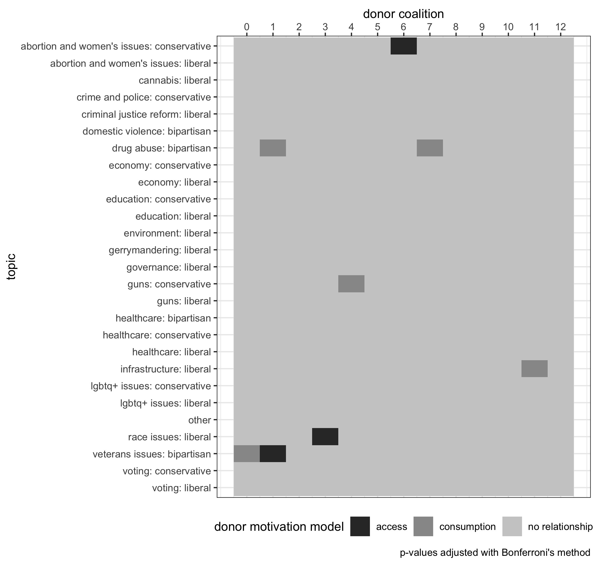
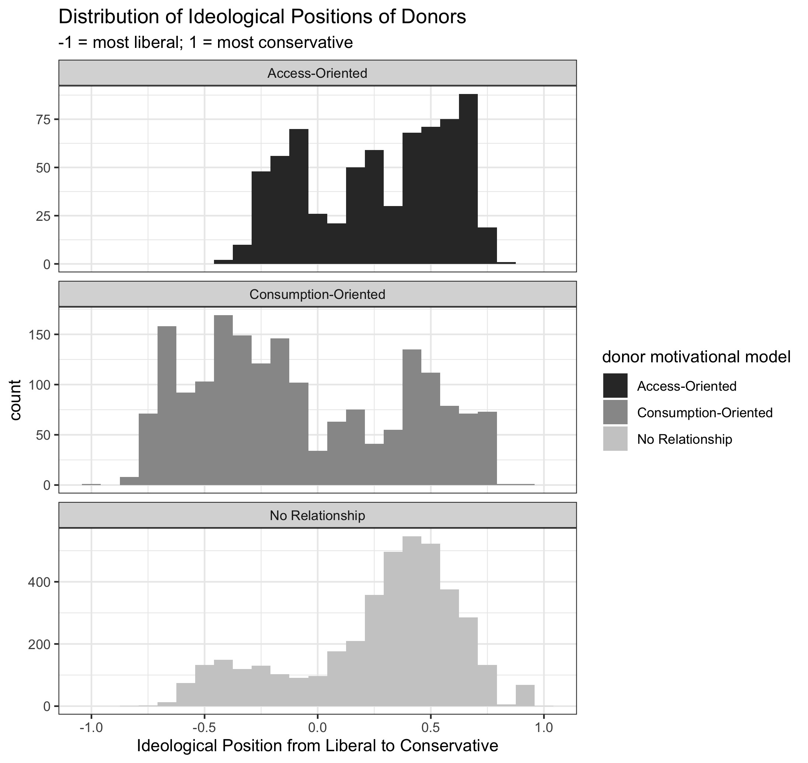
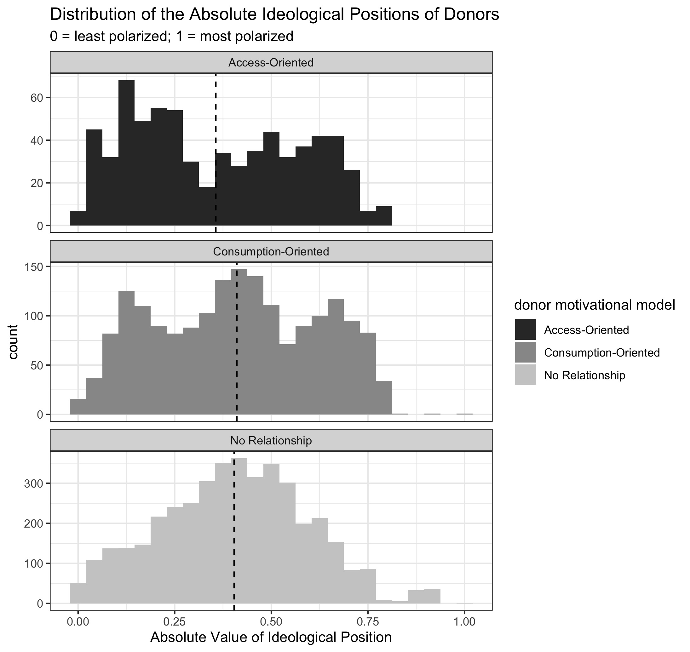

---
output:
  pdf_document:
    keep_tex: true
    fig_caption: true
    latex_engine: pdflatex
    template: ../svm-latex-ms.tex
#  word_document:
#always_allow_html: yes
title: "Political Donor Motivations and Public Support of Policies: A Time-Series Analysis"
thanks: "Code and data available at: github.com/rossdahlke"
author:
- name: Ross Dahlke
affiliation: Stanford University
abstract: "The two predominant theories of political donor motivations are the access-oriented model and the consumption model. This paper combines political donation records and social media posts from politicians to examine behaviors predicted by these two theories using a time-series methodology. The access-oriented model of donors predicts that donations from specific groups of donors will precede public support of certain policies. The consumption model predicts that donations from various groups of donors will lag in response to public support of certain policy issues. This paper statistically derives coalitions of similar donors and tests the competing models of political donor motivations. While post research has treated each model monolithically, presuming that all donors operate under one model or the other, I find evidence of both motivational models in different donors."
keywords: ""
date: "`r format(Sys.time(), '%B %d, %Y')`"
geometry: margin=1in
fontfamily: mathpazo
fontsize: 12pt
spacing: double
bibliography: bibliography.bib
biblio-style: apsr
csl: ../american-journal-of-political-science.csl
header-includes: \usepackage{graphicx}
---

```{r echo = F, message = F}
knitr::opts_chunk$set(include = F, echo = F, warning = F, message = F)
library(tidyverse)
```

# Introduction

The amount of money raised and spent by political campaigns in the United States continues to rise with each election cycle [@goldmacher2020]. However, the explanations of the motivations of political donors, the psychological reasons why political donors decide to make a contribution, remain unsettled. The predominant theories of political donor motivation fall into two categories, the access-oriented model or the consumption model. In the access-oriented model, contributions are given in exchange for access to politicians [@francia2003]. The consumption model of donations sees donors as participants in the political process who seek to alter election probabilities in a way that helps one’s preferred campaign, similar to how voting seeks to help a campaign achieve election [@ansolabehere2003]. Despite taking diametric views of political donors, the two models share the similarity that past researchers have predominantly subscribed to a single model and don’t consider the possibility of both of the models existing in different donors. In other words, most previous scholarship on political donors does not allow for the possibility that different political donors may have differing reasons for making their contribution.

The present work eschews this zero-sum view of the motivations of political donors. Instead, the two predominant models are both investigated under assumptions that allow them to co-exist by looking for both motivational models among different groups of donors. Researchers readily operate under the idea that individuals can have differing reasons for why and how they vote (e.g. [@arceneaux2009; @feldman1982; @lau1985; @rahn1994; @yiannakis1981]). Then why has so much of past research on donors either pitted the two models of donor motivations against one another (e.g. [@welch1980]) or operated exclusively in the domain of either the access-oriented model (e.g. [@baker2020a; @fellowes2004; @fouirnaies2015; @francia2003; @herndon1982; @kalla2016; @langbein1986; @powell2016]) or consumption model (e.g. @ansolabehere2003])?

This paper makes three main contributions to the literature on political donors. First, it tests the two models of political donors in a way that allows both models to exist among different donors. Second, instead of arbitrary classification of donors, such as large versus small donors, I take a bottom-up network approach to studying political donors where donors are clustered together based on network connections based on donations patterns. Finally, I layer in social media data to fundraising data and show the value that using politicians’ social media data can have on understanding political actors. Using these novel approaches to understanding political donor behavior, we find evidence that both models, the access-oriented and consumption models, likely exist, but within different donors. 

# Access-Oriented Model

Access-oriented political donors attempt to use their contributions to gain access to politicians. Most often, access-oriented motivations are thought to be the reason behind contributions from large donors. The idea is that donations can gain individuals access to politicians and their staff to influence legislative behaviors [@francia2003].

Congress is an information ecology where competing facts and perspectives are everywhere and ever-changing. Providing political contributions can allow political contributors to gain direct access by cutting through all the noise of competing information that the legislator might be encountering [@milbrath1958]. Interest groups and individuals have the goal of gaining access to politicians through their financial contributions in order to influence government policies [@baker2020a; @fouirnaies2015; @herndon1982; @powell2016]. These attempts to buy access are successful in gaining meetings with congressional offices for both special interest groups [@langbein1986] and individual donors [@kalla2016].

Measuring the direct access that political financiers gain from political contributions can be a challenging endeavor due to all of the noise in the political ecology. Instead, researchers have treated the "access" component of contributor influence as an implicit assumption and instead look for evidence of "influence" of political contributors on politicians. Many political science papers do not use the explicit term "access-oriented donor" and instead refer to their work as examining the potential "influence" of political donors on politicians. This line of influence research inherently implies a gain of access by political contributors. In order to influence public policy, one must first have access to politicians in order to communicate with them because the contribution itself does not carry any intrinsic message [@langbein1986]. In other words, studies that examine the influence of political donors make the assumption of the access-oriented model because influence requires access.

Contributions from financial [@hayes2017], telecommunications [@edwards2016], education [@constant2006], environmental [@hogan2020] and healthcare interest groups [@mckay2018] have all influenced legislation. Any connection that does exist between campaign contributors and public policy has a stronger impact if the contributions are from organized business interests within a member's district [@hall1990], similar to how members of congress prioritize public opinion of their district over national public opinion [@butler2011]. Further, there is a stronger influence as a result of contributions from individuals with business interests, opposed to PACs, which many other studies focus on [@fellowes2004]. While it is "nearly universal" [@bonica2016] that corporate executives of Fortune 500 firms make political contributions [@fremeth2013], there is heterogeneity in their political leanings [@bonica2016]. 

Potentially, the influence exerted by contributors when making a political contribution is so indirect that it does not always materialize in statistical patterns of legislative voting or public policy. Yet there is evidence of the influence towards the benefit of the financial contributor. Interest groups seek both direct and indirect access to the policy making process [@fouirnaies2018]. Firms that contribute to winning political campaigns have abnormal financial returns after the election [@akey2015; @cooper2010]. In addition to immediately-felt financial returns, donors may systematically contribute money to legislative agenda setters, such as chairs of financial committees, in an effort to set future legislative agendas [@fouirnaies2018]. Even business executives understand that political contributions are purchases of "good will" which are positive in return but are not frequent nor universal [@gordon2007]. For example, political contributions reduce the punishment for business executives who are sanctioned for committing fraud [@fulmer2017]; increase the number of "sweetheart" contracts awarded from the government [@ferris2019]; and increase the premium and survivability of Initial Public Offerings (IPOs) [@gounopoulos2021].  

Instead of focusing on direct access or financial outcomes, this research article examines politicians' public support of policy issues. Under the access-oriented model of political donor motivations, one would expect to find politicians to be more supportive of certain policy issues after receiving campaign contributions from access-oriented donors. This hypothesis will be tested using a Granger causality model [@granger], which is an econometric methodology to test whether changes in one time series predict future changes in another time series. 

**$H_{1a}$: Donations from coalitions of political donors will precede, or Granger cause, increased public support of certain political issues from the politicians to whom they donate.**

Since access-oriented donors are thought to be wealthier contributors, sometimes seeking access for financial gain, this paper will also examine the amount contributed by members of donor coalitions that are accepted by $H_{1a}$. 

**$H_{2a}$: Donors from access-oriented coalitions will on average be _larger_ contributors to political campaigns than donors not in access-oriented coalitions.**

# Consumption Model

While the access-oriented model is centered on donors _influencing_ the political process, the consumption model is about donors _participating_ in the political process. The consumption model of political donors concludes that political contributions are not vehicles by which donors seek access to politicians but instead are acts of consumption, or in other words, participation [@ansolabehere2003]. Under this model, individual donors are intrinsically motivated by ideology [@ansolabehere2003]. People do not receive a direct benefit by making a political donation, but they do experience the indirect benefits of participating in a political campaign that matches their ideology. Said another way, for consumption-motivated donors, making a contribution is just an extension of voting on a participatory spectrum. Under this approach, donations are a way for individuals to participate and be responsive to their "perception of the stakes in the election" [@hill2017]. 

Ideological proximity, or the spatial distance between the ideology of candidates and donors, is an important component to the consumption model of political donors, [@ensley2009]. It is potentially of greater importance than agreement between the donor and the candidate on specific policy issue positions [@barber2019], such as taxes, global warming, and gay rights. Studies have shown that the similarity between a donor's policy preferences and a senator's roll-call votes is a predictor of whether a donor makes a contribution [@barber2017]. However, it is unclear if this connection between contributors' policy preferences and legislators' votes holds historically or only recently [@caneswrone2019]. Divergence of ideology among the candidates for an office, such as a more extreme political opponent, does not impact donors' decisions to make a contribution [@ensley2009]. The theoretical implications for this paper are that consumption-oriented donors will contribute to politicians who already show support for the policy issues, or are ideologically proximate, to themselves. In other words, donors reward for policy proximity between themselves and candidates.

Altogether, under the consumption model of donor motivations one would expect public support of policy issues to attract political donors who care about that policy, which leads to $H_{3}$.

**$H_{1b}$: Public support from politicians on certain political issues will precede, or Granger cause, donations from coalitions of political donors.**

Individual donors, as opposed to PACs, continue to make up a clear majority of donations to political candidates [@heerwig2016]. These individual donors most often exhibit behavior consistent with the consumption model of donations [@barber2016a; @heerwig2016]. Further, individual donors arguably play an even more central role in politics more recently with the growth in small-dollar individual donors. 

With the rise of small-dollar donors on the internet and the assumption that these donors fit under the consumption model of donor motivations, this paper will examine the amount of money contributed by members of donor coalitions that are accepted by $H_{1b}$. 

**$H_{2b}$: Donors from consumption coalitions will on average be _smaller_ contributors to political campaigns than donors not in consumption coalitions.**

# Rise of Small-Dollar Donors

The growing number of small-dollar donors in the political process suggests that there will be more consumption-oriented donors in the future. The anecdotal examples of the Bernie Sanders and Donald Trump 2016 and 2020 presidential campaigns, both of which received a large number of small-dollar donors [@choma2020], illustrate the consumption-oriented model's connection to such donors. Small-dollar donors likely did not directly access or influence the politics of the Sanders or Trump campaigns. Instead, donors reacted to their messages and decided to move further down the participatory spectrum in those campaigns. Individual contributors are mostly participants in politics without an ulterior motive. They are "fickle financiers of elections" whose donation habits can be disrupted by little changes to their worlds such as moving to an area that is more or less Democratic or Republican [@kettler2019].

The Democratic Party as a whole has recently grown its proportion of funding from small-dollar donors [@albert2020]. Moreover, incumbents have been able to sustain their small-dollar fundraising programs [@heberlig2020]--suggesting that this trend is not going to go away. This growth in small-dollar donors has created a donorate that is more demographically representative of America but is more ideologically extreme [@albert2020] and one that gives indiscriminately to incumbents, challengers, and open seat candidates [@culberson2019]. It is conceivable that campaigns that rely on small donors will adopt rhetoric and tout their "outsider" status in an effort to activate these small, more ideologically extreme donors [@arbour2020]. For instance, extremist politicians can leverage polarizing events to raise more money for their campaigns [@oklobdzija2017]. As a result, some have predicted that small-dollar donors will polarize the nation's politics even further [@oklobdzija2017]. Although legislators who receive a large number of small-dollar donors are not more polarized in their voting in the next legislative session, legislators taking up a more polarized agenda does increase the number of small-dollar donors they attract in the subsequent election [@keena2019]. This provides further evidence for the consumption model of political donor motivations. Other studies have agreed that mass donors are the cause of partisan polarization [@laraja2012], but this conclusion is not definitive [@harden2016]. Therefore, even though small-dollar donors themselves may not be polarizing, they may provide incentive for politicians to take more polarized positions.

This research paper will also examine the polarization of political donor coalitions and whether consumption-oriented donors and access-oriented donors are in polarized positions in the donor network graph. 

**$H_{3a}$: Consumption-motivated donors will be more polarized in the political donor network than non-consumption donors.**

**$H_{3b}$: Access-oriented donors will be less polarized in the political donor network than non-access donors.**


# Data

Data for this research come from two primary sources: politicians' social media posts and data on political donation data. 

For social media posts, this paper used the Facebook [@rfacebook] and Twitter [@rtweet] APIs to collect social media posts from all candidates for the Wisconsin State Senate and Wisconsin State Assembly during the 2016 election cycle (_n_ = 82,851). A random subset of 12,364 posts, or about 15% of the total posts collected, were hand-coded into 27 topical categories. These topical categories included if the post was made in support or opposition to a policy. For example, the "voting liberal" category contains posts that are supportive of repealing voting ID laws and expanding early voting whereas the "voting conservative" category contains posts that are in support of voter ID laws and other conservative voting reforms.

These posts were used to train and test a BERT deep learning transfer model where about 90% (or 11,128) were used in the training set and about 10% (or 1,236), were used in the test set. This trained model achieved 82.9% accuracy in categorizing the topic of posts in the held-out test set. Furthermore, this model was applied to the rest of the uncoded corpus that were later used for aggregations and calculations of the topics that politicians were posting about.

BERT, which stands for Bidirectional Encoder Representations from Transformers, is a pre-trained deep learning model to which researchers can add additional output layers, in this case to classify social media posts into the hand-coded topical categories [@bert]. BERT is currently a state-of-the-art model in the field of Natural Language Processing [@bert]. BERT and other transfer learning models have yet to be widely adopted by political scientists but are an ideal choice for political science text classification, especially when compared to traditional text-as-data methods in the discipline [@terechshenko2020]. BERT has been applied to other social media research such as the detection of propaganda [@vlad2019], misinformation [@jiang2020], hate speech [@mozafari2020], stance [@tian2020], and aggression [@ramiandrisoa2020].

Social media can be useful in studying politics because digital communication methods are similar to traditional political communication and can be extrapolated to offline characteristics. The differences that are seen in online political communication, such as lowered costs and eased barriers to entry, represent a “difference-of-degree” and not a paradigm shifting “difference-in-kind” [@karpf2010]. There is a strong connection between online channels of communication in the form of social networks and offline connections, including the building and maintenance of social capital from those offline connections [@cranshaw2010; @ellison2006; @liben2005; @scellato2010]. Online social networks have also been used to study offline-based actions and beliefs like opinion polarization [@lee2014], political polarization [@hanna2013], political participation [@lawrence2010] and political discourse [@kushin2009]. Further, in modern campaigns, it is unlikely that issues would not be discussed online. In other words, it is unlikely that there would be other events, such as the salience of a particular issue that attracts political donors, that do not make it to social media. 

Individual political donation data for all candidates to the Wisconsin State Legislature during the 2016 election cycle were collected from the Wisconsin Campaign Information System (CFIS). Anonymous contributions were removed, names were made uniform (removed punctuation, made all names lowercase, etc.), and OpenRefine [@openrefine] was used to stem names to identify people who might be the same person (e.g., Jim Smith and James Smith). To ensure that people who have the same name, but are different people, were not counted as the same individual, their zip code was appended to the end of their name to create a unique identifier. Finally, only contributions from donors who contributed to more than one campaign were used, following previous research that emphasizes the importance of repeat donors, particularly when making inferences [@heerwig2018]. These steps left 28,858  donations from 7,567 donors.

These donations were used to create a network of political donations with candidates and donors serving as nodes and donations between them as edges. This network was clustered into 13 distinct communities so that donors in each community are most similar to one another based on which campaigns they contributed to. The Louvain method as implemented by Gephi [@gephi] did the clustering, or community detection.

This donor cluster network is visualized in Figure 1 using the Yifan Hu layout algorithm [@yifanhu] with the two political parties clearly divided with two large groups of donors, Democrats on the left, and Republicans on the right. The graph is colored by the statistical community the donor and candidates are in. 


# Results

## Donor Motivation Models

$H_{1a}$ and $H_{1b}$ test the relationships between the social media dataset and the political donation dataset. I tested the two models of political donor motivations using a Granger causality time-series model. Other social media studies have used this methodology [@freelon2018; @lukito2020]. For example, other researchers have used it to study the relationship between social media and non-social media events such as offline protests [@bastos2015] and stock prices [@park2017]. Granger causality detects whether movements in one time series precedes, lags, has a confounding variable, or is not related to another time series [@granger]. An abbreviated version of this methodology takes two time series variables X and Y. First, one builds a vector autoregression (VAR) model to predict the outcome variable Y with Y being the sole predictor in the model. In other words, the model only uses Y to predict Y. Then, a second model is built where both variables X and Y are used to build the VAR to predict Y. Effectively, if the second model, with the inclusion of X, does a better job of predicting Y than the first model alone, as measured by an _F_-statistic, X is said to Granger cause Y. To test for the possibility of counfounding variables, the methodology flips X and Y and performs the same process. If the null is rejected in both instances, then there is likely a confounding variable Z. This analysis was conducted in R [@r] with the `lmtest` package [@lmtest]. P-values were adjusted with the Bonferroni method [@bonferroni]. The optimal lag for each model was calculated using a Bayesian Information Criteria [@bic] implemented by the `tsDyn` package [@tsdyn]. Altogether, this method allows me to test whether politicians' social media posts and donations from groups of donors are likely related.

I compare two time series, one of social media posts and another of political contributions from clusters of donors. The first time series constists of the number of social media posts per day for each topic that were made by campaigns. The analysis only included campaigns that received contributions from a donor cluster. In other words, a time series of donations from a donor coalition was compared to the aggregate count of posts about a given topic made by candidates that the donor cluster contributed to. For example, donations from donor coalition 6 Granger caused politicians that received donations from the coalition to publicly support women's issue and pro-choice policies. Stated another way, donations from coalition 6 predict whether candidates will publicly support pro-women policies. The theoretical connection to political donor psychology is that this behavior is expected under the access-oriented model of political donor motivations. Coalitions and policy topics that are accepted by either $H_{1a}$ or $H_{1b}$ are in Table 1. The full results of the Granger causality tests are visualized in Figure 2. 

```{r include = T}
read_csv("../data/granger_results.csv") %>% 
  filter(result != "no relationship") %>% 
  mutate(f_statistic = round(f_statistic, 1),
         p_value = if_else(p_value < .001, "<.001", as.character(p_value))) %>% 
  knitr::kable(col.names = c("coalition", "policy topic", "model", "Lag", "F-statistic", "p-value"),
             caption = "H1a and H1b acceptances")
```




There are three donor coalitions that show behavior consistent with the access-oriented model. For these three groups and policy issues, $H_{1a}$ is accepted. These access-oriented coalitions represent 1,572 individual donors or 21.3% of all donors in the dataset; 6,489 individual donations or 22.4% of donations; and $654,577.60 or 16.5% of dollars contributed. Each of these three coalitions appear to have unique policy and even ideological positions that they support.

In addition to these three access-oriented clusters of donors, five coalitions of donors exhibit behavior that one would expect under the consumption model of donor motivations and are accepted by $H_{1b}$. In other words, public support of various policy issues from campaigns predicts donations from these coalitions. The five consumption-motivated clusters of donors contain: 2,702 (36.7%) of donors; 11,080 (38.4%) of donations; and donated a collective $1,341,129.70 (33.8%) of money contributed. Similar to access-oriented clusters, consumption-oriented coalitions show significant relationships to policy issues across the ideological spectrum.

These results were used to test $H_{1a}$ and $H_{1b}$. Donor coalitions and the topic of social media posts that were accepted by $H_{1a}$ and $H_{1b}$ are listed in Table 1.

## Donor Sizes

Coalitions of donors that were accepted by only $H_{1a}$ or $H_{1b}$ were used to test $H_{2a}$, that access-oriented donors are on-average larger donors, and $H_{2b}$, that consumption-oriented donors are on-average smaller donors, with a difference-in-means permutation test. A non-parametric bootstrap was used since the statistical assumptions were not met for an OLS regression. Results to $H_{2a}$ and $H_{2b}$ are in Table 2. Neither the access-oriented donors nor the consumption-oriented donors contributed statistically significantly different amounts of money than the other donors.

```{r include = TRUE}
tibble(hypothesis = c("$H_{2a}$", "$H_{2b}$")) %>% 
  cbind(read_csv("../data/contribution_size_permutation.csv")) %>% 
  mutate(ci = paste0(round(lower_ci, 2),", ",round(upper_ci, 2)),
         mean_diff = round(mean_diff, 2)) %>% 
  select(hypothesis, model, mean_diff, ci, p_value) %>% 
  knitr::kable(col.names = c("Hypothesis", "Model", "Avg. Diff", "95% CI", "p-value"),
               caption = "Difference in Average Donor Size")
```

A histogram showing the total contributions of donors by motivational model are in Figure 3.


## Donor Spatial Positions

To study the polarization of consumption-motivated donors, I extract the x-coordinate, the axis of ideological position, from the donor network (Figure 1). The positions of all the donors grouped by motivational model is shown in Figure 4.



Table 3 shows the breakdown of donors who contribute a majority of their money to Democrats and Republicans by motivational model.

```{r, include = TRUE}
read_csv("../tables_and_figures/party_category_breakdown.csv") %>% 
  select(category, per_rep, per_dem) %>% 
  mutate(category = case_when(
    category == "0_no_relationship" ~ "No Relationship",
    category == "access" ~ "Access-Oriented only",
    category == "consumption" ~ "Consumption-Oriented only"),
    per_rep = scales::percent(per_rep, .1),
    per_dem = scales::percent(per_dem, .1)) %>% 
  arrange(category) %>% 
  knitr::kable(col.names = c("Motivational Model", "% Republican", "% Democrat"),
               caption = "Percent of donors categorized as each motivational model who contributed a majority of their money to Republicans and Democrats")
```


I then rescale the coordinate position to be -1 to 1, with -1 representing the most Democratic node and 1 representing the most Republican node. To test $H_{3a}$, that consumption-oriented donors are more polarized in the network graph, and $H_{3b}$, that access-oriented donors are less polarized in the network graph, a difference-in-means permutation test was conducted on the absolute value of the rescaled x-coordinate with the coalition category as a variable. A non-parametric permutation test was used since the statistical assumptions for an OLS regression were not met. This absolute value effectively is the level of polarization in the graph, with the nodes that are on the extremes of the graph being closer to 1 and the central-most nodes, representing bipartisan donors, being closer to 0. Results for $H_{3a}$ and $H_{3b}$ are in Table 4. Consumption-motivated donors are on average in more polarized positions (further to the left and right of the graph) than non-consumption-oriented donors, and access-oriented donors are on average in less polarized positions (closer to the middle of the graph) than non-access-oriented donors. 

```{r include = TRUE}
tibble(hypothesis = c("$H_{3a}$", "$H_{3b}$")) %>% 
  cbind(read_csv("../data/contribution_polarization_permutation.csv")) %>% 
  mutate(ci = paste0(round(lower_ci, 2),", ",round(upper_ci, 2)),
         mean_diff = round(mean_diff, 2),
         p_value = if_else(p_value == 0, "<.001", as.character(p_value))) %>% 
  select(hypothesis, model, mean_diff, ci, p_value) %>% 
  arrange(hypothesis) %>% 
  knitr::kable(col.names = c("Hypothesis", "Model", "Avg. Diff", "95% CI", "p-value"),
               caption = "Difference in Average Donor Position Polarization")
```

The polarized positions of all the donors are shown by group in Figure 5. 



# Discussion

I find evidence that eschews historical scholarship that political donors are monolithic in their motivations. Instead, I find that different donors hold different motivations.

Different donor coalitions exhibited behavior that is in line with both the access-oriented and consumption model of political donations with policy issues across the ideological spectrum of liberal, conservative, and bipartisan. Example social media posts of the various topics can be found in the appendix. 

While much of the popular concern over money in politics is around access-oriented donors manipulating the political system, I find that there are more consumption-oriented--rather than access-oriented--donors  (2,702 versus 1,572), donations (11,080 versus 6,489), and total amount contributed by each type (\$1,341,129.70 versus $654,577.60). While any number of access-oriented donors may remain concerning to some in the public, these results suggest that more people use political donations as a vehicle for increased participation in, not manipulation of, the political process. 

One idea about political donors is that access-oriented donors are large-dollar donors with financial incentives, but the results of $H_{2a}$ reject this idea in the context of the 2016 elections in Wisconsin. Donors in access-oriented coalitions do not contribute statistically significantly more money on-average than other donors. Just because a donor is not contributing a large sum of money themselves does not mean that they are not seeking to coax a politician into supporting specific policies. This attempt at influence can be amplified when coalitions of donors operate in conjunction with one another. For example, members of an interest group could each contribute a relatively small amount of money, but in the aggregate, the unified donations could potentially gain that interest group access to a politician. A future study could replicate this analysis with multiple election cycles or study multiple states or federal elections to achieve higher statistical power. 

The stereotype of consumption-motivated donors is of small-dollar donors whose contributions are harnessed online. Similar to access-oriented donors, $H_{2b}$ is rejected and consumption-motivated donors are not on-average smaller donors than other contributors. Again, these results suggest a rethinking of the notion that the amount of money one contributes is indicative of one's motivations. If someone is able to contribute a large sum of money and they care about a certain issue, it stands to reason that they may just support politicians who already care about that issue. This paper challenges conventional beliefs on the size of access-oriented versus consumptive donors.

In contrast, this paper concurs with the literature that consumption-motivated donors are in more polarized spatial positions within the donor graph than non-consumptive donors. Access-oriented donors are more centrally located. The acceptances of $H_{3a}$ and $H_{3b}$ are in agreement with past literature. These results provide descriptive context and are not meant to imply any level of causality. Past studies have either suggested or found a connection between donor motivations and political polarization, and this study also finds these descriptive relationships. Future studies should examine the causal mechanisms of these relationships. Do candidates take more polarizing stances in an effort to court consumptive donors? Has an increased number of consumptive donors helped more polarized candidates to win office? Do access-oriented donors seek out campaigns that are more moderate? Or can access-oriented donors influence the ideological extremity of candidates?

In addition to the finding that both models can exist in different donor coalitions, it is also possible that the same cluster can operate under both models. One of the thirteen donor clusters, coalition 1, revealed a duality where they were access-oriented in relation to one policy issue and consumption-oriented in relation to another. While it is possible that this finding is statistical noise, there is additional face validity because the two issues the donor coalition had a relationship with were both bipartisan issues--veterans issues and drug abuse. Few studies have come to the conclusion that donors can operate with both motivational models. While this study finds this behavior to be relatively rare, in only one donor cluster, it hints to a more complex view as to why donors make a political contribution. Further, public support of one policy issue, veteran's issues, is both Granger caused by donations from a coalition and Granger causes another coalition to make a contribution. This result suggests that issues can play different roles to different groups of political donors. One group of donors can seek access to influence a policy, and another group can display consumptive behavior and reward politicians who already publicly support that policy.

Finally, there has been a debate among campaign-finance scholars as to whether donation motivations are driven by only ideological proximity or specific policy issues. I find that policy issues are a factor in contribution motivations, at least for the specific groups that exhibit access-oriented or consumptive behavior. The policy issues that are connected to donor clusters in this study range the political spectrum, including liberal policies (race issues, public infrastructure), conservative policies (pro-life, pro-gun), and bipartisan issues (drug abuse, veteran's issues). Further, some of the topics are perennial focuses of campaigns, such as pro-life politics. Other issues were particularly salient during this election cycle, such as veterans issues with the Tomah Veterans' Affair hospital scandal [@honl2016] and King Veterans' Home scandal. These two scandals created an electoral environment in which veterans' issues were in the public focus, and results from this paper suggest that some political donors both sought to influence campaigns to address these issues as well as reward politicians for their focus on the topic.

Six of the thirteen coalitions of donors did not display access-oriented or consumption-oriented behavior with the policy topics tested. The motivations behind these clusters of donors remain unclear. It is possible that they are motivated by ideological proximity in a way that is not adequately tested using the methods in this paper. Future studies should test other potential reasons that people make political contributions, such as individuals contributing to ideologically proximate campaigns, geographically local campaigns, competitive campaigns, or other potential motivations.

# Limitations

Like all observational studies, this research cannot claim true causality. While the main methodology employed is formally called "Granger causality," this causality is in an econometric sense and is more akin to predictive value. So while the findings of this paper do have predictive power--for example, donations from certain groups of individuals successfully receiving candidates to publicly support policy issues--true causal claims cannot be made. Future studies should use the findings from this research to conduct lab experiments where causal claims can be made.

I found discrete examples of donor coalitions demonstrating access-oriented or consumptive behavior on specific issues. However, these results do not suggest that these donors only care about those issues or that other donors do not care about these issues. Instead, these donors have a unique statistical relationship where when they contribute money to a political campaign, it either predicts or is predicted by campaigns' public support of policy issues. Future studies can employ surveys to identify if the statistical relationships found in an analysis like this present work concur with people's self conceptions. Do donor coalitions who donate in a consumptive fashion, that is where they contribute to a campaign after they publicly support an issue, actually report that they prioritize that issue? Possibly, these behaviors are subconscious reactions. Donors may not be able to exactly identify _why_ they like a candidate or may report some other reason, when it is actually a reinforcement of a concurrence between their policies and the information environment that they consume.

Finally, this study was not meant to find nor did it find exhaustive evidence as to what motivates ever single donor in the dataset. Even within the information ecology, this study does not consider things like news stories or personal friend circles. Moreover, there are other potential reasons that donors make contributions, such as geographic proximity where people donate to their local candidates or allocating money to competitive races. Future research can consider these other variables as possible explanations for political donations.

# Conclusion

Campaign finance scholars are divided on the motivations of political donors. Do political donors seek to buy access, to participate more in politics, or some combination of both? This study finds that different coalitions of donors, and in one instance, a singular coalition, exhibit behavior that is consistent with different motivational models. Overall, there are more consumptive donors compared to access-oriented donors. In addition, there is no statistical difference in the average contributor size of access-oriented and consumption-oriented donors compared to other donors. However, access-oriented donors are found to be more spatially central within donor networks, and consumptive donors are more polarized. While past research has largely treated political donors as a monolith, with the possibility of operating under a single, I find that different donors can have different motivational models.


\newpage

# Appendix

```{r echo = F, include = T}
tibble::tibble("example #" = c("1", "2", "3", "4", "5", "6", "7", "8", "9", "10", "11", "12"),
       "topic" = c("race issues: liberal", "race issues: liberal", "abortion and women's issues: conservative", "abortion and women's issues: conservative", "abortion and women's issues: conservative", "veterans issues: bipartisan", "veterans issues: bipartisan", "guns: conservative", "guns: conservative", "infrastructure: liberal", "infrastructure: liberal", "drug abuse: bipartisan"),
       "campaign" = c("Bowen 4 Action", "Citizens of the 81st for Dave Considine", "Ken Skowronski for Assembly", "Friends & Neighbors of Robin Vos", "Friends of Chuck Wichgers", "Sanfelippo for Assembly", "Citizens for Peter Barca", "Scott Fitzgerald for Senate", "Kremer for Wisconsin", "Friends of Jonathan Brostoff", "Wachs for Assembly", "Michael Schraa for Assembly"), 
       "social media site" = c("Twitter", "Twitter", "Facebook", "Twitter", "Facebook", "Twitter", "Twitter", "Twitter", "Facebook", "Facebook", "Twitter", "Facebook"), 
       "post" = c("@ JoyAnnReid: #OscarsSoWhite black people can't even get nominated for the movies about black people...", "1 in every 9 African-Americans are disenfranchised because of felony convictions in Wisconsin", "Last night I had a great time at the Wisconsin Right to Life Dinner with my fellow colleagues. I am proud to have supported the bold Pro-Life reforms we have put in place and I will continue to defend the rights of those who cannot defend themselves.", "An Assembly committee will vote on a bill to ban the sale of aborted children's body parts on Wednesday.", "'I'm glad to know Chuck, who is a solid conservative. He's shown that he understands the principles that secure our freedom and that he will work for them in office. But more than that, I've seen that he is passionate about the God-given dignity of every human life. He knows that every person's right to live and to live freely comes from a much higher source than government.'PATRICK MCILHERAN, FORMER EDITORIAL WRITER, MILWAUKEE JOURNAL SENTINEL", "Welcome Home Veterans Initiative seeks to solve veteran homelessness in state:", "Regionalizing Wisconsin's county veterans service offices remains a concern in vet community", "Thanks to the Wisconsin Game Preserve Association for the honor of their 2015 Legislator of the Year award!", "This is a fair interview with Frederica Freyberg discussing the 'Campus Carry Act' in Wisconsin.  This aired on public television yesterday morning.", "Dr. Mark Stout has written a compelling alternative to the $1.1 billion highway proposal. This option that would save money and provide a brighter, more progressive, more responsible future for our state. If you haven't yet, please take a look and share widely.", "WI roads rank 3rd worst in US. Yet Scott Walker isnt ready to put politics aside to solve our infrastructure woes.", "A great story about the HOPE Agenda and my colleague on Joint Finance, WI State Rep John Nygren's efforts to fight against heroin and opiate addiction.")
       ) %>% 
  kableExtra::kbl(longtable = T, caption = "Social Media Examples") %>% 
  kableExtra::column_spec(1, width = ".65in") %>% 
  kableExtra::column_spec(2, width = ".6in") %>% 
  kableExtra::column_spec(3, width = ".7in") %>% 
  kableExtra::column_spec(4, width = ".6in") %>% 
  kableExtra::column_spec(5, width = "3in") %>% 
  kableExtra::kable_styling(latex_options =c("repeat_header"))
```

```{r include = T}
wordcountaddin:::text_stats()
```

# References
